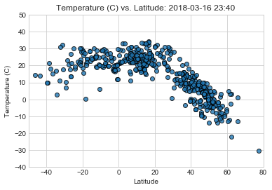
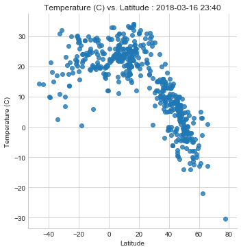
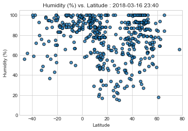
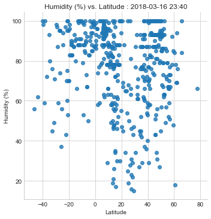
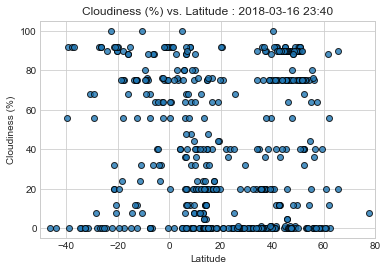
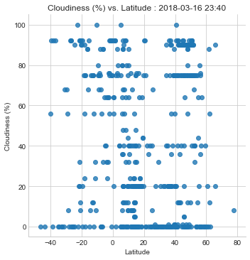
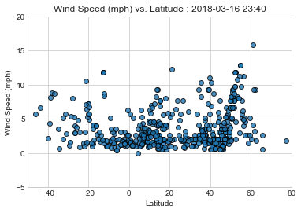
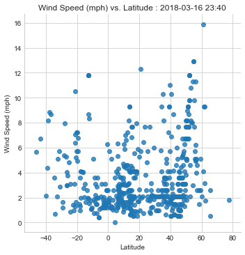

```python
# Dependencies
import numpy as np
import pandas as pd
import matplotlib.pyplot as plt
import requests
import time
import openweathermapy.core as owm
import random
import datetime
import seaborn as sns


# OWM API Key from config
from config import api_key
```


```python
#OBSERVABLE TRENDS
#--> There is a corelation between latitude and temperature: Cities with negative and minor latitude, have warm weather.
#--> Cities close to The Equator (latitude 0), has more % humidity.
#--> Cities with higher temperatures, has also a high percentage of humidity
```


```python
#CSV with cities from all the world
cities_df = pd.read_csv("Resources/worldcities.csv")
cities_df.head()

#In order to make a sample to cover all regions in the world, I didn' use coords because most of them are negative, 
#that's why I couldn't find a correct way to make groups with them.

#However, to cover all regions, I choose 3 cities from each country
cities_per_country = cities_df["Country"].value_counts()

cities_per_country_df = pd.DataFrame({"Num Cities":cities_per_country})

#Countries with at least 3 cities
selected_countries = cities_per_country_df[cities_per_country_df["Num Cities"].astype(int) > 3]
selected_countries.head()
```


<div>
<style>
    .dataframe thead tr:only-child th {
        text-align: right;
    }

    .dataframe thead th {
        text-align: left;
    }

    .dataframe tbody tr th {
        vertical-align: top;
    }
</style>
<table border="1" class="dataframe">
  <thead>
    <tr style="text-align: right;">
      <th></th>
      <th>Num Cities</th>
    </tr>
  </thead>
  <tbody>
    <tr>
      <th>ru</th>
      <td>4262</td>
    </tr>
    <tr>
      <th>us</th>
      <td>4170</td>
    </tr>
    <tr>
      <th>ph</th>
      <td>3752</td>
    </tr>
    <tr>
      <th>in</th>
      <td>2995</td>
    </tr>
    <tr>
      <th>ro</th>
      <td>2745</td>
    </tr>
  </tbody>
</table>
</div>


```python
#This loops selects 3 random cities for each selected country

choices=[]
for index, row in selected_countries.iterrows():
    counter=0
    cities_country=[]
    cities_country_df=cities_df.loc[cities_df['Country']==index]
    cities_country=cities_country_df.City.unique()
     
    while counter < 3:
        
        try: 
            selection = random.choice(cities_country)
           
            if selection not in choices:
                choices.append(selection)
                counter=counter+1
                
        except ValueError:
            continue
```


```python
 # Save config information.
url = "http://api.openweathermap.org/data/2.5/weather?"
units = "metric"

# Build partial query URL
query_url = f"{url}appid={api_key}&units={units}&q="
```


```python
#Creatinf a dataframe with selected cities
results_df= pd.DataFrame(choices,columns=['City'])

# Create blank columns in DataFrame 
results_df["Country"]=None
results_df["Temperature (C)"]=None
results_df["Humidity (%)"]=None
results_df["Cloudiness (%)"]=None
results_df["Wind Speed (mph)"]=None
results_df["Latitude"]=None
results_df["Longitude"]=None


# Counter
row_count = 0

for index,row in results_df.iterrows():
    #Printing log: City +URL
    city=row["City"]
    weather_data = requests.get(query_url + city)
    print(f"Now retrieving city # {row_count}: {city}")
          
    print(weather_data.url)
    row_count += 1

    try:
        weather_data = weather_data.json()
                    
        results_df.set_value(index,"City",city)
        results_df.set_value(index,"Country",weather_data["sys"]["country"])
        results_df.set_value(index,"Temperature (C)",weather_data["main"]["temp"])
        results_df.set_value(index,"Humidity (%)",weather_data["main"]["humidity"])
        results_df.set_value(index,"Cloudiness (%)",weather_data["clouds"]["all"])
        results_df.set_value(index,"Wind Speed (mph)",weather_data["wind"]["speed"])
        results_df.set_value(index,"Latitude", weather_data["coord"]["lat"])
        results_df.set_value(index,"Longitude", weather_data["coord"]["lon"])
    except:
        print("No weather results")
        continue
results_df.head()
```

    Now retrieving city # 0: pyatigorskiy
    http://api.openweathermap.org/data/2.5/weather?appid=25bc90a1196e6f153eece0bc0b0fc9eb&units=metric&q=pyatigorskiy
    Now retrieving city # 1: veydelevka
    http://api.openweathermap.org/data/2.5/weather?appid=25bc90a1196e6f153eece0bc0b0fc9eb&units=metric&q=veydelevka
    Now retrieving city # 2: isheyevka
    http://api.openweathermap.org/data/2.5/weather?appid=25bc90a1196e6f153eece0bc0b0fc9eb&units=metric&q=isheyevka
    Now retrieving city # 3: englewood
    http://api.openweathermap.org/data/2.5/weather?appid=25bc90a1196e6f153eece0bc0b0fc9eb&units=metric&q=englewood
    Now retrieving city # 4: turlock
    http://api.openweathermap.org/data/2.5/weather?appid=25bc90a1196e6f153eece0bc0b0fc9eb&units=metric&q=turlock
    Now retrieving city # 5: hagerstown
    http://api.openweathermap.org/data/2.5/weather?appid=25bc90a1196e6f153eece0bc0b0fc9eb&units=metric&q=hagerstown
    Now retrieving city # 6: mambatangan
    http://api.openweathermap.org/data/2.5/weather?appid=25bc90a1196e6f153eece0bc0b0fc9eb&units=metric&q=mambatangan
    Now retrieving city # 7: gabaldon
    http://api.openweathermap.org/data/2.5/weather?appid=25bc90a1196e6f153eece0bc0b0fc9eb&units=metric&q=gabaldon
    Now retrieving city # 8: nalvo
    http://api.openweathermap.org/data/2.5/weather?appid=25bc90a1196e6f153eece0bc0b0fc9eb&units=metric&q=nalvo
    Now retrieving city # 9: hirekerur
    http://api.openweathermap.org/data/2.5/weather?appid=25bc90a1196e6f153eece0bc0b0fc9eb&units=metric&q=hirekerur
    Now retrieving city # 10: gajraula
    http://api.openweathermap.org/data/2.5/weather?appid=25bc90a1196e6f153eece0bc0b0fc9eb&units=metric&q=gajraula
    Now retrieving city # 11: karari
    http://api.openweathermap.org/data/2.5/weather?appid=25bc90a1196e6f153eece0bc0b0fc9eb&units=metric&q=karari
    Now retrieving city # 12: mihail eminescu
    http://api.openweathermap.org/data/2.5/weather?appid=25bc90a1196e6f153eece0bc0b0fc9eb&units=metric&q=mihail%20eminescu
    Now retrieving city # 13: rusca montana
    http://api.openweathermap.org/data/2.5/weather?appid=25bc90a1196e6f153eece0bc0b0fc9eb&units=metric&q=rusca%20montana
    No weather results
    Now retrieving city # 14: boisoara
    http://api.openweathermap.org/data/2.5/weather?appid=25bc90a1196e6f153eece0bc0b0fc9eb&units=metric&q=boisoara
    Now retrieving city # 15: teixeira
    http://api.openweathermap.org/data/2.5/weather?appid=25bc90a1196e6f153eece0bc0b0fc9eb&units=metric&q=teixeira
    Now retrieving city # 16: teofilo otoni
    http://api.openweathermap.org/data/2.5/weather?appid=25bc90a1196e6f153eece0bc0b0fc9eb&units=metric&q=teofilo%20otoni
    Now retrieving city # 17: uarini
    http://api.openweathermap.org/data/2.5/weather?appid=25bc90a1196e6f153eece0bc0b0fc9eb&units=metric&q=uarini
    Now retrieving city # 18: el burrion
    http://api.openweathermap.org/data/2.5/weather?appid=25bc90a1196e6f153eece0bc0b0fc9eb&units=metric&q=el%20burrion
    Now retrieving city # 19: nezahualcoyotl
    http://api.openweathermap.org/data/2.5/weather?appid=25bc90a1196e6f153eece0bc0b0fc9eb&units=metric&q=nezahualcoyotl
    No weather results
    Now retrieving city # 20: mier
    http://api.openweathermap.org/data/2.5/weather?appid=25bc90a1196e6f153eece0bc0b0fc9eb&units=metric&q=mier
    Now retrieving city # 21: rietberg
    http://api.openweathermap.org/data/2.5/weather?appid=25bc90a1196e6f153eece0bc0b0fc9eb&units=metric&q=rietberg
    Now retrieving city # 22: schwalmtal
    http://api.openweathermap.org/data/2.5/weather?appid=25bc90a1196e6f153eece0bc0b0fc9eb&units=metric&q=schwalmtal
    Now retrieving city # 23: hagen
    http://api.openweathermap.org/data/2.5/weather?appid=25bc90a1196e6f153eece0bc0b0fc9eb&units=metric&q=hagen
    Now retrieving city # 24: tirano
    http://api.openweathermap.org/data/2.5/weather?appid=25bc90a1196e6f153eece0bc0b0fc9eb&units=metric&q=tirano
    Now retrieving city # 25: melilli
    http://api.openweathermap.org/data/2.5/weather?appid=25bc90a1196e6f153eece0bc0b0fc9eb&units=metric&q=melilli
    Now retrieving city # 26: san dona di piave
    http://api.openweathermap.org/data/2.5/weather?appid=25bc90a1196e6f153eece0bc0b0fc9eb&units=metric&q=san%20dona%20di%20piave
    Now retrieving city # 27: rodotopion
    http://api.openweathermap.org/data/2.5/weather?appid=25bc90a1196e6f153eece0bc0b0fc9eb&units=metric&q=rodotopion
    Now retrieving city # 28: epitalion
    http://api.openweathermap.org/data/2.5/weather?appid=25bc90a1196e6f153eece0bc0b0fc9eb&units=metric&q=epitalion
    Now retrieving city # 29: vayia
    http://api.openweathermap.org/data/2.5/weather?appid=25bc90a1196e6f153eece0bc0b0fc9eb&units=metric&q=vayia
    No weather results
    Now retrieving city # 30: oiba
    http://api.openweathermap.org/data/2.5/weather?appid=25bc90a1196e6f153eece0bc0b0fc9eb&units=metric&q=oiba
    Now retrieving city # 31: giron
    http://api.openweathermap.org/data/2.5/weather?appid=25bc90a1196e6f153eece0bc0b0fc9eb&units=metric&q=giron
    Now retrieving city # 32: sevilla
    http://api.openweathermap.org/data/2.5/weather?appid=25bc90a1196e6f153eece0bc0b0fc9eb&units=metric&q=sevilla
    Now retrieving city # 33: coutances
    http://api.openweathermap.org/data/2.5/weather?appid=25bc90a1196e6f153eece0bc0b0fc9eb&units=metric&q=coutances
    Now retrieving city # 34: fleury-les-aubrais
    http://api.openweathermap.org/data/2.5/weather?appid=25bc90a1196e6f153eece0bc0b0fc9eb&units=metric&q=fleury-les-aubrais
    Now retrieving city # 35: caudebec-les-elbeuf
    http://api.openweathermap.org/data/2.5/weather?appid=25bc90a1196e6f153eece0bc0b0fc9eb&units=metric&q=caudebec-les-elbeuf
    Now retrieving city # 36: crawley
    http://api.openweathermap.org/data/2.5/weather?appid=25bc90a1196e6f153eece0bc0b0fc9eb&units=metric&q=crawley
    Now retrieving city # 37: strathmiglo
    http://api.openweathermap.org/data/2.5/weather?appid=25bc90a1196e6f153eece0bc0b0fc9eb&units=metric&q=strathmiglo
    Now retrieving city # 38: northampton
    http://api.openweathermap.org/data/2.5/weather?appid=25bc90a1196e6f153eece0bc0b0fc9eb&units=metric&q=northampton
    Now retrieving city # 39: oroszlany
    http://api.openweathermap.org/data/2.5/weather?appid=25bc90a1196e6f153eece0bc0b0fc9eb&units=metric&q=oroszlany
    Now retrieving city # 40: nagyecsed
    http://api.openweathermap.org/data/2.5/weather?appid=25bc90a1196e6f153eece0bc0b0fc9eb&units=metric&q=nagyecsed
    Now retrieving city # 41: csabrendek
    http://api.openweathermap.org/data/2.5/weather?appid=25bc90a1196e6f153eece0bc0b0fc9eb&units=metric&q=csabrendek
    Now retrieving city # 42: ichnya
    http://api.openweathermap.org/data/2.5/weather?appid=25bc90a1196e6f153eece0bc0b0fc9eb&units=metric&q=ichnya
    Now retrieving city # 43: preobrazhenka
    http://api.openweathermap.org/data/2.5/weather?appid=25bc90a1196e6f153eece0bc0b0fc9eb&units=metric&q=preobrazhenka
    Now retrieving city # 44: kodra
    http://api.openweathermap.org/data/2.5/weather?appid=25bc90a1196e6f153eece0bc0b0fc9eb&units=metric&q=kodra
    Now retrieving city # 45: soja
    http://api.openweathermap.org/data/2.5/weather?appid=25bc90a1196e6f153eece0bc0b0fc9eb&units=metric&q=soja
    Now retrieving city # 46: hamura
    http://api.openweathermap.org/data/2.5/weather?appid=25bc90a1196e6f153eece0bc0b0fc9eb&units=metric&q=hamura
    Now retrieving city # 47: hiroshima
    http://api.openweathermap.org/data/2.5/weather?appid=25bc90a1196e6f153eece0bc0b0fc9eb&units=metric&q=hiroshima
    Now retrieving city # 48: mingshui
    http://api.openweathermap.org/data/2.5/weather?appid=25bc90a1196e6f153eece0bc0b0fc9eb&units=metric&q=mingshui
    Now retrieving city # 49: weihai
    http://api.openweathermap.org/data/2.5/weather?appid=25bc90a1196e6f153eece0bc0b0fc9eb&units=metric&q=weihai
    Now retrieving city # 50: dalinghe
    http://api.openweathermap.org/data/2.5/weather?appid=25bc90a1196e6f153eece0bc0b0fc9eb&units=metric&q=dalinghe
    No weather results
    Now retrieving city # 51: cookshire
    http://api.openweathermap.org/data/2.5/weather?appid=25bc90a1196e6f153eece0bc0b0fc9eb&units=metric&q=cookshire
    No weather results
    Now retrieving city # 52: saint-jerome
    http://api.openweathermap.org/data/2.5/weather?appid=25bc90a1196e6f153eece0bc0b0fc9eb&units=metric&q=saint-jerome
    Now retrieving city # 53: virden
    http://api.openweathermap.org/data/2.5/weather?appid=25bc90a1196e6f153eece0bc0b0fc9eb&units=metric&q=virden
    Now retrieving city # 54: banov
    http://api.openweathermap.org/data/2.5/weather?appid=25bc90a1196e6f153eece0bc0b0fc9eb&units=metric&q=banov
    Now retrieving city # 55: becov
    http://api.openweathermap.org/data/2.5/weather?appid=25bc90a1196e6f153eece0bc0b0fc9eb&units=metric&q=becov
    Now retrieving city # 56: libusin
    http://api.openweathermap.org/data/2.5/weather?appid=25bc90a1196e6f153eece0bc0b0fc9eb&units=metric&q=libusin
    No weather results
    Now retrieving city # 57: duyure
    http://api.openweathermap.org/data/2.5/weather?appid=25bc90a1196e6f153eece0bc0b0fc9eb&units=metric&q=duyure
    Now retrieving city # 58: agalteca
    http://api.openweathermap.org/data/2.5/weather?appid=25bc90a1196e6f153eece0bc0b0fc9eb&units=metric&q=agalteca
    Now retrieving city # 59: aramecina
    http://api.openweathermap.org/data/2.5/weather?appid=25bc90a1196e6f153eece0bc0b0fc9eb&units=metric&q=aramecina
    Now retrieving city # 60: paliseul
    http://api.openweathermap.org/data/2.5/weather?appid=25bc90a1196e6f153eece0bc0b0fc9eb&units=metric&q=paliseul
    Now retrieving city # 61: profondeville
    http://api.openweathermap.org/data/2.5/weather?appid=25bc90a1196e6f153eece0bc0b0fc9eb&units=metric&q=profondeville
    Now retrieving city # 62: zwevegem
    http://api.openweathermap.org/data/2.5/weather?appid=25bc90a1196e6f153eece0bc0b0fc9eb&units=metric&q=zwevegem
    Now retrieving city # 63: dos hermanas
    http://api.openweathermap.org/data/2.5/weather?appid=25bc90a1196e6f153eece0bc0b0fc9eb&units=metric&q=dos%20hermanas
    Now retrieving city # 64: nijar
    http://api.openweathermap.org/data/2.5/weather?appid=25bc90a1196e6f153eece0bc0b0fc9eb&units=metric&q=nijar
    Now retrieving city # 65: ronda
    http://api.openweathermap.org/data/2.5/weather?appid=25bc90a1196e6f153eece0bc0b0fc9eb&units=metric&q=ronda
    Now retrieving city # 66: castanheira do ribatejo
    http://api.openweathermap.org/data/2.5/weather?appid=25bc90a1196e6f153eece0bc0b0fc9eb&units=metric&q=castanheira%20do%20ribatejo
    Now retrieving city # 67: almeirim
    http://api.openweathermap.org/data/2.5/weather?appid=25bc90a1196e6f153eece0bc0b0fc9eb&units=metric&q=almeirim
    Now retrieving city # 68: sande
    http://api.openweathermap.org/data/2.5/weather?appid=25bc90a1196e6f153eece0bc0b0fc9eb&units=metric&q=sande
    Now retrieving city # 69: wodzislaw slaski
    http://api.openweathermap.org/data/2.5/weather?appid=25bc90a1196e6f153eece0bc0b0fc9eb&units=metric&q=wodzislaw%20slaski
    Now retrieving city # 70: pabianice
    http://api.openweathermap.org/data/2.5/weather?appid=25bc90a1196e6f153eece0bc0b0fc9eb&units=metric&q=pabianice
    Now retrieving city # 71: ustron
    http://api.openweathermap.org/data/2.5/weather?appid=25bc90a1196e6f153eece0bc0b0fc9eb&units=metric&q=ustron
    Now retrieving city # 72: ngawi
    http://api.openweathermap.org/data/2.5/weather?appid=25bc90a1196e6f153eece0bc0b0fc9eb&units=metric&q=ngawi
    Now retrieving city # 73: cikampek
    http://api.openweathermap.org/data/2.5/weather?appid=25bc90a1196e6f153eece0bc0b0fc9eb&units=metric&q=cikampek
    Now retrieving city # 74: mlati
    http://api.openweathermap.org/data/2.5/weather?appid=25bc90a1196e6f153eece0bc0b0fc9eb&units=metric&q=mlati
    Now retrieving city # 75: as
    http://api.openweathermap.org/data/2.5/weather?appid=25bc90a1196e6f153eece0bc0b0fc9eb&units=metric&q=as
    No weather results
    Now retrieving city # 76: sundvollen
    http://api.openweathermap.org/data/2.5/weather?appid=25bc90a1196e6f153eece0bc0b0fc9eb&units=metric&q=sundvollen
    No weather results
    Now retrieving city # 77: sveio
    http://api.openweathermap.org/data/2.5/weather?appid=25bc90a1196e6f153eece0bc0b0fc9eb&units=metric&q=sveio
    Now retrieving city # 78: kohat
    http://api.openweathermap.org/data/2.5/weather?appid=25bc90a1196e6f153eece0bc0b0fc9eb&units=metric&q=kohat
    Now retrieving city # 79: kambar
    http://api.openweathermap.org/data/2.5/weather?appid=25bc90a1196e6f153eece0bc0b0fc9eb&units=metric&q=kambar
    Now retrieving city # 80: kot addu
    http://api.openweathermap.org/data/2.5/weather?appid=25bc90a1196e6f153eece0bc0b0fc9eb&units=metric&q=kot%20addu
    Now retrieving city # 81: haarlem
    http://api.openweathermap.org/data/2.5/weather?appid=25bc90a1196e6f153eece0bc0b0fc9eb&units=metric&q=haarlem
    Now retrieving city # 82: wisch
    http://api.openweathermap.org/data/2.5/weather?appid=25bc90a1196e6f153eece0bc0b0fc9eb&units=metric&q=wisch
    Now retrieving city # 83: almere
    http://api.openweathermap.org/data/2.5/weather?appid=25bc90a1196e6f153eece0bc0b0fc9eb&units=metric&q=almere
    Now retrieving city # 84: pachalum
    http://api.openweathermap.org/data/2.5/weather?appid=25bc90a1196e6f153eece0bc0b0fc9eb&units=metric&q=pachalum
    Now retrieving city # 85: santa maria de jesus
    http://api.openweathermap.org/data/2.5/weather?appid=25bc90a1196e6f153eece0bc0b0fc9eb&units=metric&q=santa%20maria%20de%20jesus
    Now retrieving city # 86: morales
    http://api.openweathermap.org/data/2.5/weather?appid=25bc90a1196e6f153eece0bc0b0fc9eb&units=metric&q=morales
    Now retrieving city # 87: brande
    http://api.openweathermap.org/data/2.5/weather?appid=25bc90a1196e6f153eece0bc0b0fc9eb&units=metric&q=brande
    Now retrieving city # 88: starup
    http://api.openweathermap.org/data/2.5/weather?appid=25bc90a1196e6f153eece0bc0b0fc9eb&units=metric&q=starup
    Now retrieving city # 89: borup
    http://api.openweathermap.org/data/2.5/weather?appid=25bc90a1196e6f153eece0bc0b0fc9eb&units=metric&q=borup
    Now retrieving city # 90: le locle
    http://api.openweathermap.org/data/2.5/weather?appid=25bc90a1196e6f153eece0bc0b0fc9eb&units=metric&q=le%20locle
    Now retrieving city # 91: ettingen
    http://api.openweathermap.org/data/2.5/weather?appid=25bc90a1196e6f153eece0bc0b0fc9eb&units=metric&q=ettingen
    Now retrieving city # 92: frenkendorf
    http://api.openweathermap.org/data/2.5/weather?appid=25bc90a1196e6f153eece0bc0b0fc9eb&units=metric&q=frenkendorf
    Now retrieving city # 93: aygestan
    http://api.openweathermap.org/data/2.5/weather?appid=25bc90a1196e6f153eece0bc0b0fc9eb&units=metric&q=aygestan
    Now retrieving city # 94: kasakh
    http://api.openweathermap.org/data/2.5/weather?appid=25bc90a1196e6f153eece0bc0b0fc9eb&units=metric&q=kasakh
    Now retrieving city # 95: maisyan
    http://api.openweathermap.org/data/2.5/weather?appid=25bc90a1196e6f153eece0bc0b0fc9eb&units=metric&q=maisyan
    No weather results
    Now retrieving city # 96: kibara
    http://api.openweathermap.org/data/2.5/weather?appid=25bc90a1196e6f153eece0bc0b0fc9eb&units=metric&q=kibara
    Now retrieving city # 97: rujewa
    http://api.openweathermap.org/data/2.5/weather?appid=25bc90a1196e6f153eece0bc0b0fc9eb&units=metric&q=rujewa
    Now retrieving city # 98: bariadi
    http://api.openweathermap.org/data/2.5/weather?appid=25bc90a1196e6f153eece0bc0b0fc9eb&units=metric&q=bariadi
    Now retrieving city # 99: picsi
    http://api.openweathermap.org/data/2.5/weather?appid=25bc90a1196e6f153eece0bc0b0fc9eb&units=metric&q=picsi
    Now retrieving city # 100: yanahuanca
    http://api.openweathermap.org/data/2.5/weather?appid=25bc90a1196e6f153eece0bc0b0fc9eb&units=metric&q=yanahuanca
    Now retrieving city # 101: trujillo
    http://api.openweathermap.org/data/2.5/weather?appid=25bc90a1196e6f153eece0bc0b0fc9eb&units=metric&q=trujillo
    Now retrieving city # 102: zile
    http://api.openweathermap.org/data/2.5/weather?appid=25bc90a1196e6f153eece0bc0b0fc9eb&units=metric&q=zile
    Now retrieving city # 103: uzunkopru
    http://api.openweathermap.org/data/2.5/weather?appid=25bc90a1196e6f153eece0bc0b0fc9eb&units=metric&q=uzunkopru
    No weather results
    Now retrieving city # 104: tepecik
    http://api.openweathermap.org/data/2.5/weather?appid=25bc90a1196e6f153eece0bc0b0fc9eb&units=metric&q=tepecik
    Now retrieving city # 105: phanom sarakham
    http://api.openweathermap.org/data/2.5/weather?appid=25bc90a1196e6f153eece0bc0b0fc9eb&units=metric&q=phanom%20sarakham
    Now retrieving city # 106: surin
    http://api.openweathermap.org/data/2.5/weather?appid=25bc90a1196e6f153eece0bc0b0fc9eb&units=metric&q=surin
    Now retrieving city # 107: ko samui
    http://api.openweathermap.org/data/2.5/weather?appid=25bc90a1196e6f153eece0bc0b0fc9eb&units=metric&q=ko%20samui
    Now retrieving city # 108: backo gradiste
    http://api.openweathermap.org/data/2.5/weather?appid=25bc90a1196e6f153eece0bc0b0fc9eb&units=metric&q=backo%20gradiste
    Now retrieving city # 109: medveda
    http://api.openweathermap.org/data/2.5/weather?appid=25bc90a1196e6f153eece0bc0b0fc9eb&units=metric&q=medveda
    Now retrieving city # 110: jasa tomic
    http://api.openweathermap.org/data/2.5/weather?appid=25bc90a1196e6f153eece0bc0b0fc9eb&units=metric&q=jasa%20tomic
    Now retrieving city # 111: lidice
    http://api.openweathermap.org/data/2.5/weather?appid=25bc90a1196e6f153eece0bc0b0fc9eb&units=metric&q=lidice
    Now retrieving city # 112: canita
    http://api.openweathermap.org/data/2.5/weather?appid=25bc90a1196e6f153eece0bc0b0fc9eb&units=metric&q=canita
    Now retrieving city # 113: cermeno
    http://api.openweathermap.org/data/2.5/weather?appid=25bc90a1196e6f153eece0bc0b0fc9eb&units=metric&q=cermeno
    Now retrieving city # 114: ebensee
    http://api.openweathermap.org/data/2.5/weather?appid=25bc90a1196e6f153eece0bc0b0fc9eb&units=metric&q=ebensee
    Now retrieving city # 115: marchtrenk
    http://api.openweathermap.org/data/2.5/weather?appid=25bc90a1196e6f153eece0bc0b0fc9eb&units=metric&q=marchtrenk
    Now retrieving city # 116: lochau
    http://api.openweathermap.org/data/2.5/weather?appid=25bc90a1196e6f153eece0bc0b0fc9eb&units=metric&q=lochau
    Now retrieving city # 117: banovici
    http://api.openweathermap.org/data/2.5/weather?appid=25bc90a1196e6f153eece0bc0b0fc9eb&units=metric&q=banovici
    Now retrieving city # 118: cazin
    http://api.openweathermap.org/data/2.5/weather?appid=25bc90a1196e6f153eece0bc0b0fc9eb&units=metric&q=cazin
    Now retrieving city # 119: velika kladusa
    http://api.openweathermap.org/data/2.5/weather?appid=25bc90a1196e6f153eece0bc0b0fc9eb&units=metric&q=velika%20kladusa
    Now retrieving city # 120: pavlikeni
    http://api.openweathermap.org/data/2.5/weather?appid=25bc90a1196e6f153eece0bc0b0fc9eb&units=metric&q=pavlikeni
    Now retrieving city # 121: elena
    http://api.openweathermap.org/data/2.5/weather?appid=25bc90a1196e6f153eece0bc0b0fc9eb&units=metric&q=elena
    Now retrieving city # 122: guljanci
    http://api.openweathermap.org/data/2.5/weather?appid=25bc90a1196e6f153eece0bc0b0fc9eb&units=metric&q=guljanci
    No weather results
    Now retrieving city # 123: utrecht
    http://api.openweathermap.org/data/2.5/weather?appid=25bc90a1196e6f153eece0bc0b0fc9eb&units=metric&q=utrecht
    Now retrieving city # 124: lebowakgomo
    http://api.openweathermap.org/data/2.5/weather?appid=25bc90a1196e6f153eece0bc0b0fc9eb&units=metric&q=lebowakgomo
    Now retrieving city # 125: jan kempdorp
    http://api.openweathermap.org/data/2.5/weather?appid=25bc90a1196e6f153eece0bc0b0fc9eb&units=metric&q=jan%20kempdorp
    Now retrieving city # 126: buderim
    http://api.openweathermap.org/data/2.5/weather?appid=25bc90a1196e6f153eece0bc0b0fc9eb&units=metric&q=buderim
    Now retrieving city # 127: port macquarie
    http://api.openweathermap.org/data/2.5/weather?appid=25bc90a1196e6f153eece0bc0b0fc9eb&units=metric&q=port%20macquarie
    Now retrieving city # 128: howard springs
    http://api.openweathermap.org/data/2.5/weather?appid=25bc90a1196e6f153eece0bc0b0fc9eb&units=metric&q=howard%20springs
    Now retrieving city # 129: tootsi
    http://api.openweathermap.org/data/2.5/weather?appid=25bc90a1196e6f153eece0bc0b0fc9eb&units=metric&q=tootsi
    Now retrieving city # 130: ulenurme
    http://api.openweathermap.org/data/2.5/weather?appid=25bc90a1196e6f153eece0bc0b0fc9eb&units=metric&q=ulenurme
    Now retrieving city # 131: tabasalu
    http://api.openweathermap.org/data/2.5/weather?appid=25bc90a1196e6f153eece0bc0b0fc9eb&units=metric&q=tabasalu
    Now retrieving city # 132: damghan
    http://api.openweathermap.org/data/2.5/weather?appid=25bc90a1196e6f153eece0bc0b0fc9eb&units=metric&q=damghan
    Now retrieving city # 133: lahijan
    http://api.openweathermap.org/data/2.5/weather?appid=25bc90a1196e6f153eece0bc0b0fc9eb&units=metric&q=lahijan
    Now retrieving city # 134: arak
    http://api.openweathermap.org/data/2.5/weather?appid=25bc90a1196e6f153eece0bc0b0fc9eb&units=metric&q=arak
    Now retrieving city # 135: villarrica
    http://api.openweathermap.org/data/2.5/weather?appid=25bc90a1196e6f153eece0bc0b0fc9eb&units=metric&q=villarrica
    Now retrieving city # 136: alto vera
    http://api.openweathermap.org/data/2.5/weather?appid=25bc90a1196e6f153eece0bc0b0fc9eb&units=metric&q=alto%20vera
    No weather results
    Now retrieving city # 137: bella vista
    http://api.openweathermap.org/data/2.5/weather?appid=25bc90a1196e6f153eece0bc0b0fc9eb&units=metric&q=bella%20vista
    Now retrieving city # 138: enniskerry
    http://api.openweathermap.org/data/2.5/weather?appid=25bc90a1196e6f153eece0bc0b0fc9eb&units=metric&q=enniskerry
    Now retrieving city # 139: limerick
    http://api.openweathermap.org/data/2.5/weather?appid=25bc90a1196e6f153eece0bc0b0fc9eb&units=metric&q=limerick
    Now retrieving city # 140: dingle
    http://api.openweathermap.org/data/2.5/weather?appid=25bc90a1196e6f153eece0bc0b0fc9eb&units=metric&q=dingle
    Now retrieving city # 141: matata
    http://api.openweathermap.org/data/2.5/weather?appid=25bc90a1196e6f153eece0bc0b0fc9eb&units=metric&q=matata
    Now retrieving city # 142: rakaia
    http://api.openweathermap.org/data/2.5/weather?appid=25bc90a1196e6f153eece0bc0b0fc9eb&units=metric&q=rakaia
    Now retrieving city # 143: kaitangata
    http://api.openweathermap.org/data/2.5/weather?appid=25bc90a1196e6f153eece0bc0b0fc9eb&units=metric&q=kaitangata
    Now retrieving city # 144: nkpor
    http://api.openweathermap.org/data/2.5/weather?appid=25bc90a1196e6f153eece0bc0b0fc9eb&units=metric&q=nkpor
    Now retrieving city # 145: sokoto
    http://api.openweathermap.org/data/2.5/weather?appid=25bc90a1196e6f153eece0bc0b0fc9eb&units=metric&q=sokoto
    Now retrieving city # 146: shagamu
    http://api.openweathermap.org/data/2.5/weather?appid=25bc90a1196e6f153eece0bc0b0fc9eb&units=metric&q=shagamu
    Now retrieving city # 147: capellen
    http://api.openweathermap.org/data/2.5/weather?appid=25bc90a1196e6f153eece0bc0b0fc9eb&units=metric&q=capellen
    Now retrieving city # 148: leudelange
    http://api.openweathermap.org/data/2.5/weather?appid=25bc90a1196e6f153eece0bc0b0fc9eb&units=metric&q=leudelange
    Now retrieving city # 149: helmsange
    http://api.openweathermap.org/data/2.5/weather?appid=25bc90a1196e6f153eece0bc0b0fc9eb&units=metric&q=helmsange
    Now retrieving city # 150: kapit
    http://api.openweathermap.org/data/2.5/weather?appid=25bc90a1196e6f153eece0bc0b0fc9eb&units=metric&q=kapit
    Now retrieving city # 151: batu arang
    http://api.openweathermap.org/data/2.5/weather?appid=25bc90a1196e6f153eece0bc0b0fc9eb&units=metric&q=batu%20arang
    Now retrieving city # 152: tanjong sepat
    http://api.openweathermap.org/data/2.5/weather?appid=25bc90a1196e6f153eece0bc0b0fc9eb&units=metric&q=tanjong%20sepat
    No weather results
    Now retrieving city # 153: cabaiguan
    http://api.openweathermap.org/data/2.5/weather?appid=25bc90a1196e6f153eece0bc0b0fc9eb&units=metric&q=cabaiguan
    Now retrieving city # 154: esmeralda
    http://api.openweathermap.org/data/2.5/weather?appid=25bc90a1196e6f153eece0bc0b0fc9eb&units=metric&q=esmeralda
    Now retrieving city # 155: sagua de tanamo
    http://api.openweathermap.org/data/2.5/weather?appid=25bc90a1196e6f153eece0bc0b0fc9eb&units=metric&q=sagua%20de%20tanamo
    Now retrieving city # 156: gulshat
    http://api.openweathermap.org/data/2.5/weather?appid=25bc90a1196e6f153eece0bc0b0fc9eb&units=metric&q=gulshat
    No weather results
    Now retrieving city # 157: ayagoz
    http://api.openweathermap.org/data/2.5/weather?appid=25bc90a1196e6f153eece0bc0b0fc9eb&units=metric&q=ayagoz
    Now retrieving city # 158: bestobe
    http://api.openweathermap.org/data/2.5/weather?appid=25bc90a1196e6f153eece0bc0b0fc9eb&units=metric&q=bestobe
    Now retrieving city # 159: namestovo
    http://api.openweathermap.org/data/2.5/weather?appid=25bc90a1196e6f153eece0bc0b0fc9eb&units=metric&q=namestovo
    Now retrieving city # 160: revuca
    http://api.openweathermap.org/data/2.5/weather?appid=25bc90a1196e6f153eece0bc0b0fc9eb&units=metric&q=revuca
    Now retrieving city # 161: turcianske teplice
    http://api.openweathermap.org/data/2.5/weather?appid=25bc90a1196e6f153eece0bc0b0fc9eb&units=metric&q=turcianske%20teplice
    No weather results
    Now retrieving city # 162: kamenica
    http://api.openweathermap.org/data/2.5/weather?appid=25bc90a1196e6f153eece0bc0b0fc9eb&units=metric&q=kamenica
    Now retrieving city # 163: zajas
    http://api.openweathermap.org/data/2.5/weather?appid=25bc90a1196e6f153eece0bc0b0fc9eb&units=metric&q=zajas
    Now retrieving city # 164: delogozdi
    http://api.openweathermap.org/data/2.5/weather?appid=25bc90a1196e6f153eece0bc0b0fc9eb&units=metric&q=delogozdi
    No weather results
    Now retrieving city # 165: mazeikiai
    http://api.openweathermap.org/data/2.5/weather?appid=25bc90a1196e6f153eece0bc0b0fc9eb&units=metric&q=mazeikiai
    Now retrieving city # 166: gargzdai
    http://api.openweathermap.org/data/2.5/weather?appid=25bc90a1196e6f153eece0bc0b0fc9eb&units=metric&q=gargzdai
    Now retrieving city # 167: varniai
    http://api.openweathermap.org/data/2.5/weather?appid=25bc90a1196e6f153eece0bc0b0fc9eb&units=metric&q=varniai
    Now retrieving city # 168: latacunga
    http://api.openweathermap.org/data/2.5/weather?appid=25bc90a1196e6f153eece0bc0b0fc9eb&units=metric&q=latacunga
    Now retrieving city # 169: macas
    http://api.openweathermap.org/data/2.5/weather?appid=25bc90a1196e6f153eece0bc0b0fc9eb&units=metric&q=macas
    Now retrieving city # 170: el carmen
    http://api.openweathermap.org/data/2.5/weather?appid=25bc90a1196e6f153eece0bc0b0fc9eb&units=metric&q=el%20carmen
    Now retrieving city # 171: huanuni
    http://api.openweathermap.org/data/2.5/weather?appid=25bc90a1196e6f153eece0bc0b0fc9eb&units=metric&q=huanuni
    Now retrieving city # 172: villamontes
    http://api.openweathermap.org/data/2.5/weather?appid=25bc90a1196e6f153eece0bc0b0fc9eb&units=metric&q=villamontes
    Now retrieving city # 173: concepcion
    http://api.openweathermap.org/data/2.5/weather?appid=25bc90a1196e6f153eece0bc0b0fc9eb&units=metric&q=concepcion
    Now retrieving city # 174: polzela
    http://api.openweathermap.org/data/2.5/weather?appid=25bc90a1196e6f153eece0bc0b0fc9eb&units=metric&q=polzela
    Now retrieving city # 175: crnomelj
    http://api.openweathermap.org/data/2.5/weather?appid=25bc90a1196e6f153eece0bc0b0fc9eb&units=metric&q=crnomelj
    Now retrieving city # 176: rakek
    http://api.openweathermap.org/data/2.5/weather?appid=25bc90a1196e6f153eece0bc0b0fc9eb&units=metric&q=rakek
    Now retrieving city # 177: oskarshamn
    http://api.openweathermap.org/data/2.5/weather?appid=25bc90a1196e6f153eece0bc0b0fc9eb&units=metric&q=oskarshamn
    Now retrieving city # 178: sundsvall
    http://api.openweathermap.org/data/2.5/weather?appid=25bc90a1196e6f153eece0bc0b0fc9eb&units=metric&q=sundsvall
    Now retrieving city # 179: kristianstad
    http://api.openweathermap.org/data/2.5/weather?appid=25bc90a1196e6f153eece0bc0b0fc9eb&units=metric&q=kristianstad
    Now retrieving city # 180: luanda
    http://api.openweathermap.org/data/2.5/weather?appid=25bc90a1196e6f153eece0bc0b0fc9eb&units=metric&q=luanda
    Now retrieving city # 181: gazi
    http://api.openweathermap.org/data/2.5/weather?appid=25bc90a1196e6f153eece0bc0b0fc9eb&units=metric&q=gazi
    Now retrieving city # 182: nambale
    http://api.openweathermap.org/data/2.5/weather?appid=25bc90a1196e6f153eece0bc0b0fc9eb&units=metric&q=nambale
    Now retrieving city # 183: san felipe
    http://api.openweathermap.org/data/2.5/weather?appid=25bc90a1196e6f153eece0bc0b0fc9eb&units=metric&q=san%20felipe
    Now retrieving city # 184: san carlos
    http://api.openweathermap.org/data/2.5/weather?appid=25bc90a1196e6f153eece0bc0b0fc9eb&units=metric&q=san%20carlos
    Now retrieving city # 185: valdivia
    http://api.openweathermap.org/data/2.5/weather?appid=25bc90a1196e6f153eece0bc0b0fc9eb&units=metric&q=valdivia
    Now retrieving city # 186: chirilagua
    http://api.openweathermap.org/data/2.5/weather?appid=25bc90a1196e6f153eece0bc0b0fc9eb&units=metric&q=chirilagua
    Now retrieving city # 187: nueva san salvador
    http://api.openweathermap.org/data/2.5/weather?appid=25bc90a1196e6f153eece0bc0b0fc9eb&units=metric&q=nueva%20san%20salvador
    No weather results
    Now retrieving city # 188: juayua
    http://api.openweathermap.org/data/2.5/weather?appid=25bc90a1196e6f153eece0bc0b0fc9eb&units=metric&q=juayua
    Now retrieving city # 189: lahti
    http://api.openweathermap.org/data/2.5/weather?appid=25bc90a1196e6f153eece0bc0b0fc9eb&units=metric&q=lahti
    Now retrieving city # 190: kemi
    http://api.openweathermap.org/data/2.5/weather?appid=25bc90a1196e6f153eece0bc0b0fc9eb&units=metric&q=kemi
    Now retrieving city # 191: kaarina
    http://api.openweathermap.org/data/2.5/weather?appid=25bc90a1196e6f153eece0bc0b0fc9eb&units=metric&q=kaarina
    Now retrieving city # 192: araure
    http://api.openweathermap.org/data/2.5/weather?appid=25bc90a1196e6f153eece0bc0b0fc9eb&units=metric&q=araure
    Now retrieving city # 193: san cristobal
    http://api.openweathermap.org/data/2.5/weather?appid=25bc90a1196e6f153eece0bc0b0fc9eb&units=metric&q=san%20cristobal
    Now retrieving city # 194: maracay
    http://api.openweathermap.org/data/2.5/weather?appid=25bc90a1196e6f153eece0bc0b0fc9eb&units=metric&q=maracay
    Now retrieving city # 195: siquirres
    http://api.openweathermap.org/data/2.5/weather?appid=25bc90a1196e6f153eece0bc0b0fc9eb&units=metric&q=siquirres
    Now retrieving city # 196: san isidro
    http://api.openweathermap.org/data/2.5/weather?appid=25bc90a1196e6f153eece0bc0b0fc9eb&units=metric&q=san%20isidro
    Now retrieving city # 197: roxana
    http://api.openweathermap.org/data/2.5/weather?appid=25bc90a1196e6f153eece0bc0b0fc9eb&units=metric&q=roxana
    Now retrieving city # 198: quatre soeurs
    http://api.openweathermap.org/data/2.5/weather?appid=25bc90a1196e6f153eece0bc0b0fc9eb&units=metric&q=quatre%20soeurs
    Now retrieving city # 199: fond du sac
    http://api.openweathermap.org/data/2.5/weather?appid=25bc90a1196e6f153eece0bc0b0fc9eb&units=metric&q=fond%20du%20sac
    Now retrieving city # 200: notre dame
    http://api.openweathermap.org/data/2.5/weather?appid=25bc90a1196e6f153eece0bc0b0fc9eb&units=metric&q=notre%20dame
    Now retrieving city # 201: debre birhan
    http://api.openweathermap.org/data/2.5/weather?appid=25bc90a1196e6f153eece0bc0b0fc9eb&units=metric&q=debre%20birhan
    Now retrieving city # 202: gedo
    http://api.openweathermap.org/data/2.5/weather?appid=25bc90a1196e6f153eece0bc0b0fc9eb&units=metric&q=gedo
    Now retrieving city # 203: hagere selam
    http://api.openweathermap.org/data/2.5/weather?appid=25bc90a1196e6f153eece0bc0b0fc9eb&units=metric&q=hagere%20selam
    Now retrieving city # 204: ramla
    http://api.openweathermap.org/data/2.5/weather?appid=25bc90a1196e6f153eece0bc0b0fc9eb&units=metric&q=ramla
    Now retrieving city # 205: iksal
    http://api.openweathermap.org/data/2.5/weather?appid=25bc90a1196e6f153eece0bc0b0fc9eb&units=metric&q=iksal
    Now retrieving city # 206: kefar shemaryahu
    http://api.openweathermap.org/data/2.5/weather?appid=25bc90a1196e6f153eece0bc0b0fc9eb&units=metric&q=kefar%20shemaryahu
    Now retrieving city # 207: cholan
    http://api.openweathermap.org/data/2.5/weather?appid=25bc90a1196e6f153eece0bc0b0fc9eb&units=metric&q=cholan
    No weather results
    Now retrieving city # 208: chiali
    http://api.openweathermap.org/data/2.5/weather?appid=25bc90a1196e6f153eece0bc0b0fc9eb&units=metric&q=chiali
    No weather results
    Now retrieving city # 209: huwei
    http://api.openweathermap.org/data/2.5/weather?appid=25bc90a1196e6f153eece0bc0b0fc9eb&units=metric&q=huwei
    Now retrieving city # 210: bahia blanca
    http://api.openweathermap.org/data/2.5/weather?appid=25bc90a1196e6f153eece0bc0b0fc9eb&units=metric&q=bahia%20blanca
    Now retrieving city # 211: parana
    http://api.openweathermap.org/data/2.5/weather?appid=25bc90a1196e6f153eece0bc0b0fc9eb&units=metric&q=parana
    Now retrieving city # 212: tartagal
    http://api.openweathermap.org/data/2.5/weather?appid=25bc90a1196e6f153eece0bc0b0fc9eb&units=metric&q=tartagal
    Now retrieving city # 213: ramgarh
    http://api.openweathermap.org/data/2.5/weather?appid=25bc90a1196e6f153eece0bc0b0fc9eb&units=metric&q=ramgarh
    Now retrieving city # 214: raypur
    http://api.openweathermap.org/data/2.5/weather?appid=25bc90a1196e6f153eece0bc0b0fc9eb&units=metric&q=raypur
    Now retrieving city # 215: bera
    http://api.openweathermap.org/data/2.5/weather?appid=25bc90a1196e6f153eece0bc0b0fc9eb&units=metric&q=bera
    Now retrieving city # 216: samur
    http://api.openweathermap.org/data/2.5/weather?appid=25bc90a1196e6f153eece0bc0b0fc9eb&units=metric&q=samur
    Now retrieving city # 217: ucar
    http://api.openweathermap.org/data/2.5/weather?appid=25bc90a1196e6f153eece0bc0b0fc9eb&units=metric&q=ucar
    Now retrieving city # 218: xudat
    http://api.openweathermap.org/data/2.5/weather?appid=25bc90a1196e6f153eece0bc0b0fc9eb&units=metric&q=xudat
    Now retrieving city # 219: bugiri
    http://api.openweathermap.org/data/2.5/weather?appid=25bc90a1196e6f153eece0bc0b0fc9eb&units=metric&q=bugiri
    Now retrieving city # 220: mbarara
    http://api.openweathermap.org/data/2.5/weather?appid=25bc90a1196e6f153eece0bc0b0fc9eb&units=metric&q=mbarara
    Now retrieving city # 221: jinja
    http://api.openweathermap.org/data/2.5/weather?appid=25bc90a1196e6f153eece0bc0b0fc9eb&units=metric&q=jinja
    Now retrieving city # 222: idenao
    http://api.openweathermap.org/data/2.5/weather?appid=25bc90a1196e6f153eece0bc0b0fc9eb&units=metric&q=idenao
    Now retrieving city # 223: mbengwi
    http://api.openweathermap.org/data/2.5/weather?appid=25bc90a1196e6f153eece0bc0b0fc9eb&units=metric&q=mbengwi
    Now retrieving city # 224: dibombari
    http://api.openweathermap.org/data/2.5/weather?appid=25bc90a1196e6f153eece0bc0b0fc9eb&units=metric&q=dibombari
    Now retrieving city # 225: karsava
    http://api.openweathermap.org/data/2.5/weather?appid=25bc90a1196e6f153eece0bc0b0fc9eb&units=metric&q=karsava
    Now retrieving city # 226: preili
    http://api.openweathermap.org/data/2.5/weather?appid=25bc90a1196e6f153eece0bc0b0fc9eb&units=metric&q=preili
    Now retrieving city # 227: jurmala
    http://api.openweathermap.org/data/2.5/weather?appid=25bc90a1196e6f153eece0bc0b0fc9eb&units=metric&q=jurmala
    Now retrieving city # 228: orapa
    http://api.openweathermap.org/data/2.5/weather?appid=25bc90a1196e6f153eece0bc0b0fc9eb&units=metric&q=orapa
    Now retrieving city # 229: letlhakane
    http://api.openweathermap.org/data/2.5/weather?appid=25bc90a1196e6f153eece0bc0b0fc9eb&units=metric&q=letlhakane
    Now retrieving city # 230: tsabong
    http://api.openweathermap.org/data/2.5/weather?appid=25bc90a1196e6f153eece0bc0b0fc9eb&units=metric&q=tsabong
    Now retrieving city # 231: la concepcion
    http://api.openweathermap.org/data/2.5/weather?appid=25bc90a1196e6f153eece0bc0b0fc9eb&units=metric&q=la%20concepcion
    Now retrieving city # 232: santa teresa
    http://api.openweathermap.org/data/2.5/weather?appid=25bc90a1196e6f153eece0bc0b0fc9eb&units=metric&q=santa%20teresa
    Now retrieving city # 233: boaco
    http://api.openweathermap.org/data/2.5/weather?appid=25bc90a1196e6f153eece0bc0b0fc9eb&units=metric&q=boaco
    Now retrieving city # 234: daru
    http://api.openweathermap.org/data/2.5/weather?appid=25bc90a1196e6f153eece0bc0b0fc9eb&units=metric&q=daru
    Now retrieving city # 235: seidu
    http://api.openweathermap.org/data/2.5/weather?appid=25bc90a1196e6f153eece0bc0b0fc9eb&units=metric&q=seidu
    Now retrieving city # 236: panguma
    http://api.openweathermap.org/data/2.5/weather?appid=25bc90a1196e6f153eece0bc0b0fc9eb&units=metric&q=panguma
    Now retrieving city # 237: kaniama
    http://api.openweathermap.org/data/2.5/weather?appid=25bc90a1196e6f153eece0bc0b0fc9eb&units=metric&q=kaniama
    Now retrieving city # 238: buta
    http://api.openweathermap.org/data/2.5/weather?appid=25bc90a1196e6f153eece0bc0b0fc9eb&units=metric&q=buta
    Now retrieving city # 239: watsa
    http://api.openweathermap.org/data/2.5/weather?appid=25bc90a1196e6f153eece0bc0b0fc9eb&units=metric&q=watsa
    Now retrieving city # 240: chambishi
    http://api.openweathermap.org/data/2.5/weather?appid=25bc90a1196e6f153eece0bc0b0fc9eb&units=metric&q=chambishi
    Now retrieving city # 241: nakonde
    http://api.openweathermap.org/data/2.5/weather?appid=25bc90a1196e6f153eece0bc0b0fc9eb&units=metric&q=nakonde
    Now retrieving city # 242: kalomo
    http://api.openweathermap.org/data/2.5/weather?appid=25bc90a1196e6f153eece0bc0b0fc9eb&units=metric&q=kalomo
    No weather results
    Now retrieving city # 243: ndouci
    http://api.openweathermap.org/data/2.5/weather?appid=25bc90a1196e6f153eece0bc0b0fc9eb&units=metric&q=ndouci
    No weather results
    Now retrieving city # 244: dimbokro
    http://api.openweathermap.org/data/2.5/weather?appid=25bc90a1196e6f153eece0bc0b0fc9eb&units=metric&q=dimbokro
    Now retrieving city # 245: zuenoula
    http://api.openweathermap.org/data/2.5/weather?appid=25bc90a1196e6f153eece0bc0b0fc9eb&units=metric&q=zuenoula
    Now retrieving city # 246: vale
    http://api.openweathermap.org/data/2.5/weather?appid=25bc90a1196e6f153eece0bc0b0fc9eb&units=metric&q=vale
    Now retrieving city # 247: khobi
    http://api.openweathermap.org/data/2.5/weather?appid=25bc90a1196e6f153eece0bc0b0fc9eb&units=metric&q=khobi
    Now retrieving city # 248: akhaldaba
    http://api.openweathermap.org/data/2.5/weather?appid=25bc90a1196e6f153eece0bc0b0fc9eb&units=metric&q=akhaldaba
    Now retrieving city # 249: mamurras
    http://api.openweathermap.org/data/2.5/weather?appid=25bc90a1196e6f153eece0bc0b0fc9eb&units=metric&q=mamurras
    Now retrieving city # 250: ballsh
    http://api.openweathermap.org/data/2.5/weather?appid=25bc90a1196e6f153eece0bc0b0fc9eb&units=metric&q=ballsh
    Now retrieving city # 251: koplik
    http://api.openweathermap.org/data/2.5/weather?appid=25bc90a1196e6f153eece0bc0b0fc9eb&units=metric&q=koplik
    Now retrieving city # 252: antanifotsy
    http://api.openweathermap.org/data/2.5/weather?appid=25bc90a1196e6f153eece0bc0b0fc9eb&units=metric&q=antanifotsy
    Now retrieving city # 253: beloha
    http://api.openweathermap.org/data/2.5/weather?appid=25bc90a1196e6f153eece0bc0b0fc9eb&units=metric&q=beloha
    Now retrieving city # 254: betioky
    http://api.openweathermap.org/data/2.5/weather?appid=25bc90a1196e6f153eece0bc0b0fc9eb&units=metric&q=betioky
    No weather results
    Now retrieving city # 255: mpraeso
    http://api.openweathermap.org/data/2.5/weather?appid=25bc90a1196e6f153eece0bc0b0fc9eb&units=metric&q=mpraeso
    Now retrieving city # 256: koforidua
    http://api.openweathermap.org/data/2.5/weather?appid=25bc90a1196e6f153eece0bc0b0fc9eb&units=metric&q=koforidua
    Now retrieving city # 257: bekwai
    http://api.openweathermap.org/data/2.5/weather?appid=25bc90a1196e6f153eece0bc0b0fc9eb&units=metric&q=bekwai
    Now retrieving city # 258: hue
    http://api.openweathermap.org/data/2.5/weather?appid=25bc90a1196e6f153eece0bc0b0fc9eb&units=metric&q=hue
    Now retrieving city # 259: kon tum
    http://api.openweathermap.org/data/2.5/weather?appid=25bc90a1196e6f153eece0bc0b0fc9eb&units=metric&q=kon%20tum
    Now retrieving city # 260: hanoi
    http://api.openweathermap.org/data/2.5/weather?appid=25bc90a1196e6f153eece0bc0b0fc9eb&units=metric&q=hanoi
    Now retrieving city # 261: magway
    http://api.openweathermap.org/data/2.5/weather?appid=25bc90a1196e6f153eece0bc0b0fc9eb&units=metric&q=magway
    Now retrieving city # 262: bogale
    http://api.openweathermap.org/data/2.5/weather?appid=25bc90a1196e6f153eece0bc0b0fc9eb&units=metric&q=bogale
    Now retrieving city # 263: mawlamyine
    http://api.openweathermap.org/data/2.5/weather?appid=25bc90a1196e6f153eece0bc0b0fc9eb&units=metric&q=mawlamyine
    Now retrieving city # 264: bu salim
    http://api.openweathermap.org/data/2.5/weather?appid=25bc90a1196e6f153eece0bc0b0fc9eb&units=metric&q=bu%20salim
    No weather results
    Now retrieving city # 265: sidi bin nur
    http://api.openweathermap.org/data/2.5/weather?appid=25bc90a1196e6f153eece0bc0b0fc9eb&units=metric&q=sidi%20bin%20nur
    Now retrieving city # 266: jundubah
    http://api.openweathermap.org/data/2.5/weather?appid=25bc90a1196e6f153eece0bc0b0fc9eb&units=metric&q=jundubah
    No weather results
    Now retrieving city # 267: nurota
    http://api.openweathermap.org/data/2.5/weather?appid=25bc90a1196e6f153eece0bc0b0fc9eb&units=metric&q=nurota
    Now retrieving city # 268: turtkul
    http://api.openweathermap.org/data/2.5/weather?appid=25bc90a1196e6f153eece0bc0b0fc9eb&units=metric&q=turtkul
    No weather results
    Now retrieving city # 269: andijon
    http://api.openweathermap.org/data/2.5/weather?appid=25bc90a1196e6f153eece0bc0b0fc9eb&units=metric&q=andijon
    Now retrieving city # 270: point pedro
    http://api.openweathermap.org/data/2.5/weather?appid=25bc90a1196e6f153eece0bc0b0fc9eb&units=metric&q=point%20pedro
    Now retrieving city # 271: kotikawatta
    http://api.openweathermap.org/data/2.5/weather?appid=25bc90a1196e6f153eece0bc0b0fc9eb&units=metric&q=kotikawatta
    Now retrieving city # 272: hambantota
    http://api.openweathermap.org/data/2.5/weather?appid=25bc90a1196e6f153eece0bc0b0fc9eb&units=metric&q=hambantota
    Now retrieving city # 273: kusk
    http://api.openweathermap.org/data/2.5/weather?appid=25bc90a1196e6f153eece0bc0b0fc9eb&units=metric&q=kusk
    No weather results
    Now retrieving city # 274: jurm
    http://api.openweathermap.org/data/2.5/weather?appid=25bc90a1196e6f153eece0bc0b0fc9eb&units=metric&q=jurm
    Now retrieving city # 275: cah ab
    http://api.openweathermap.org/data/2.5/weather?appid=25bc90a1196e6f153eece0bc0b0fc9eb&units=metric&q=cah%20ab
    No weather results
    Now retrieving city # 276: naugarzan
    http://api.openweathermap.org/data/2.5/weather?appid=25bc90a1196e6f153eece0bc0b0fc9eb&units=metric&q=naugarzan
    No weather results
    Now retrieving city # 277: farkhor
    http://api.openweathermap.org/data/2.5/weather?appid=25bc90a1196e6f153eece0bc0b0fc9eb&units=metric&q=farkhor
    Now retrieving city # 278: jilikul
    http://api.openweathermap.org/data/2.5/weather?appid=25bc90a1196e6f153eece0bc0b0fc9eb&units=metric&q=jilikul
    Now retrieving city # 279: azua
    http://api.openweathermap.org/data/2.5/weather?appid=25bc90a1196e6f153eece0bc0b0fc9eb&units=metric&q=azua
    Now retrieving city # 280: sosua
    http://api.openweathermap.org/data/2.5/weather?appid=25bc90a1196e6f153eece0bc0b0fc9eb&units=metric&q=sosua
    Now retrieving city # 281: esperanza
    http://api.openweathermap.org/data/2.5/weather?appid=25bc90a1196e6f153eece0bc0b0fc9eb&units=metric&q=esperanza
    Now retrieving city # 282: gzira
    http://api.openweathermap.org/data/2.5/weather?appid=25bc90a1196e6f153eece0bc0b0fc9eb&units=metric&q=gzira
    Now retrieving city # 283: zebbug
    http://api.openweathermap.org/data/2.5/weather?appid=25bc90a1196e6f153eece0bc0b0fc9eb&units=metric&q=zebbug
    Now retrieving city # 284: gudja
    http://api.openweathermap.org/data/2.5/weather?appid=25bc90a1196e6f153eece0bc0b0fc9eb&units=metric&q=gudja
    Now retrieving city # 285: vukovar
    http://api.openweathermap.org/data/2.5/weather?appid=25bc90a1196e6f153eece0bc0b0fc9eb&units=metric&q=vukovar
    Now retrieving city # 286: osijek
    http://api.openweathermap.org/data/2.5/weather?appid=25bc90a1196e6f153eece0bc0b0fc9eb&units=metric&q=osijek
    Now retrieving city # 287: zadar
    http://api.openweathermap.org/data/2.5/weather?appid=25bc90a1196e6f153eece0bc0b0fc9eb&units=metric&q=zadar
    Now retrieving city # 288: podor
    http://api.openweathermap.org/data/2.5/weather?appid=25bc90a1196e6f153eece0bc0b0fc9eb&units=metric&q=podor
    Now retrieving city # 289: kaolack
    http://api.openweathermap.org/data/2.5/weather?appid=25bc90a1196e6f153eece0bc0b0fc9eb&units=metric&q=kaolack
    Now retrieving city # 290: kolda
    http://api.openweathermap.org/data/2.5/weather?appid=25bc90a1196e6f153eece0bc0b0fc9eb&units=metric&q=kolda
    Now retrieving city # 291: fasitoouta
    http://api.openweathermap.org/data/2.5/weather?appid=25bc90a1196e6f153eece0bc0b0fc9eb&units=metric&q=fasitoouta
    Now retrieving city # 292: malie
    http://api.openweathermap.org/data/2.5/weather?appid=25bc90a1196e6f153eece0bc0b0fc9eb&units=metric&q=malie
    Now retrieving city # 293: vaisala
    http://api.openweathermap.org/data/2.5/weather?appid=25bc90a1196e6f153eece0bc0b0fc9eb&units=metric&q=vaisala
    No weather results
    Now retrieving city # 294: yambio
    http://api.openweathermap.org/data/2.5/weather?appid=25bc90a1196e6f153eece0bc0b0fc9eb&units=metric&q=yambio
    No weather results
    Now retrieving city # 295: tawkar
    http://api.openweathermap.org/data/2.5/weather?appid=25bc90a1196e6f153eece0bc0b0fc9eb&units=metric&q=tawkar
    No weather results
    Now retrieving city # 296: uwayl
    http://api.openweathermap.org/data/2.5/weather?appid=25bc90a1196e6f153eece0bc0b0fc9eb&units=metric&q=uwayl
    No weather results
    Now retrieving city # 297: toma
    http://api.openweathermap.org/data/2.5/weather?appid=25bc90a1196e6f153eece0bc0b0fc9eb&units=metric&q=toma
    Now retrieving city # 298: ouahigouya
    http://api.openweathermap.org/data/2.5/weather?appid=25bc90a1196e6f153eece0bc0b0fc9eb&units=metric&q=ouahigouya
    Now retrieving city # 299: kombissiri
    http://api.openweathermap.org/data/2.5/weather?appid=25bc90a1196e6f153eece0bc0b0fc9eb&units=metric&q=kombissiri
    Now retrieving city # 300: kundiawa
    http://api.openweathermap.org/data/2.5/weather?appid=25bc90a1196e6f153eece0bc0b0fc9eb&units=metric&q=kundiawa
    Now retrieving city # 301: goroka
    http://api.openweathermap.org/data/2.5/weather?appid=25bc90a1196e6f153eece0bc0b0fc9eb&units=metric&q=goroka
    Now retrieving city # 302: wabag
    http://api.openweathermap.org/data/2.5/weather?appid=25bc90a1196e6f153eece0bc0b0fc9eb&units=metric&q=wabag
    Now retrieving city # 303: safaga
    http://api.openweathermap.org/data/2.5/weather?appid=25bc90a1196e6f153eece0bc0b0fc9eb&units=metric&q=safaga
    No weather results
    Now retrieving city # 304: rosetta
    http://api.openweathermap.org/data/2.5/weather?appid=25bc90a1196e6f153eece0bc0b0fc9eb&units=metric&q=rosetta
    Now retrieving city # 305: el wasta
    http://api.openweathermap.org/data/2.5/weather?appid=25bc90a1196e6f153eece0bc0b0fc9eb&units=metric&q=el%20wasta
    No weather results
    Now retrieving city # 306: bossangoa
    http://api.openweathermap.org/data/2.5/weather?appid=25bc90a1196e6f153eece0bc0b0fc9eb&units=metric&q=bossangoa
    Now retrieving city # 307: gambo
    http://api.openweathermap.org/data/2.5/weather?appid=25bc90a1196e6f153eece0bc0b0fc9eb&units=metric&q=gambo
    Now retrieving city # 308: alindao
    http://api.openweathermap.org/data/2.5/weather?appid=25bc90a1196e6f153eece0bc0b0fc9eb&units=metric&q=alindao
    Now retrieving city # 309: teavaro
    http://api.openweathermap.org/data/2.5/weather?appid=25bc90a1196e6f153eece0bc0b0fc9eb&units=metric&q=teavaro
    Now retrieving city # 310: tautira
    http://api.openweathermap.org/data/2.5/weather?appid=25bc90a1196e6f153eece0bc0b0fc9eb&units=metric&q=tautira
    Now retrieving city # 311: mahina
    http://api.openweathermap.org/data/2.5/weather?appid=25bc90a1196e6f153eece0bc0b0fc9eb&units=metric&q=mahina
    Now retrieving city # 312: yarqa
    http://api.openweathermap.org/data/2.5/weather?appid=25bc90a1196e6f153eece0bc0b0fc9eb&units=metric&q=yarqa
    Now retrieving city # 313: busayra
    http://api.openweathermap.org/data/2.5/weather?appid=25bc90a1196e6f153eece0bc0b0fc9eb&units=metric&q=busayra
    Now retrieving city # 314: kafr abil
    http://api.openweathermap.org/data/2.5/weather?appid=25bc90a1196e6f153eece0bc0b0fc9eb&units=metric&q=kafr%20abil
    Now retrieving city # 315: mali
    http://api.openweathermap.org/data/2.5/weather?appid=25bc90a1196e6f153eece0bc0b0fc9eb&units=metric&q=mali
    Now retrieving city # 316: dubreka
    http://api.openweathermap.org/data/2.5/weather?appid=25bc90a1196e6f153eece0bc0b0fc9eb&units=metric&q=dubreka
    Now retrieving city # 317: tougue
    http://api.openweathermap.org/data/2.5/weather?appid=25bc90a1196e6f153eece0bc0b0fc9eb&units=metric&q=tougue
    Now retrieving city # 318: katima mulilo
    http://api.openweathermap.org/data/2.5/weather?appid=25bc90a1196e6f153eece0bc0b0fc9eb&units=metric&q=katima%20mulilo
    Now retrieving city # 319: okahandja
    http://api.openweathermap.org/data/2.5/weather?appid=25bc90a1196e6f153eece0bc0b0fc9eb&units=metric&q=okahandja
    Now retrieving city # 320: ondangwa
    http://api.openweathermap.org/data/2.5/weather?appid=25bc90a1196e6f153eece0bc0b0fc9eb&units=metric&q=ondangwa
    Now retrieving city # 321: bousso
    http://api.openweathermap.org/data/2.5/weather?appid=25bc90a1196e6f153eece0bc0b0fc9eb&units=metric&q=bousso
    No weather results
    Now retrieving city # 322: goundi
    http://api.openweathermap.org/data/2.5/weather?appid=25bc90a1196e6f153eece0bc0b0fc9eb&units=metric&q=goundi
    Now retrieving city # 323: bokoro
    http://api.openweathermap.org/data/2.5/weather?appid=25bc90a1196e6f153eece0bc0b0fc9eb&units=metric&q=bokoro
    No weather results
    Now retrieving city # 324: pando
    http://api.openweathermap.org/data/2.5/weather?appid=25bc90a1196e6f153eece0bc0b0fc9eb&units=metric&q=pando
    Now retrieving city # 325: rivera
    http://api.openweathermap.org/data/2.5/weather?appid=25bc90a1196e6f153eece0bc0b0fc9eb&units=metric&q=rivera
    Now retrieving city # 326: montevideo
    http://api.openweathermap.org/data/2.5/weather?appid=25bc90a1196e6f153eece0bc0b0fc9eb&units=metric&q=montevideo
    Now retrieving city # 327: kollo
    http://api.openweathermap.org/data/2.5/weather?appid=25bc90a1196e6f153eece0bc0b0fc9eb&units=metric&q=kollo
    Now retrieving city # 328: tibiri
    http://api.openweathermap.org/data/2.5/weather?appid=25bc90a1196e6f153eece0bc0b0fc9eb&units=metric&q=tibiri
    Now retrieving city # 329: diffa
    http://api.openweathermap.org/data/2.5/weather?appid=25bc90a1196e6f153eece0bc0b0fc9eb&units=metric&q=diffa
    Now retrieving city # 330: banepa
    http://api.openweathermap.org/data/2.5/weather?appid=25bc90a1196e6f153eece0bc0b0fc9eb&units=metric&q=banepa
    Now retrieving city # 331: tulsipur
    http://api.openweathermap.org/data/2.5/weather?appid=25bc90a1196e6f153eece0bc0b0fc9eb&units=metric&q=tulsipur
    Now retrieving city # 332: tikapur
    http://api.openweathermap.org/data/2.5/weather?appid=25bc90a1196e6f153eece0bc0b0fc9eb&units=metric&q=tikapur
    Now retrieving city # 333: djenne
    http://api.openweathermap.org/data/2.5/weather?appid=25bc90a1196e6f153eece0bc0b0fc9eb&units=metric&q=djenne
    Now retrieving city # 334: sikasso
    http://api.openweathermap.org/data/2.5/weather?appid=25bc90a1196e6f153eece0bc0b0fc9eb&units=metric&q=sikasso
    Now retrieving city # 335: araouane
    http://api.openweathermap.org/data/2.5/weather?appid=25bc90a1196e6f153eece0bc0b0fc9eb&units=metric&q=araouane
    Now retrieving city # 336: straseni
    http://api.openweathermap.org/data/2.5/weather?appid=25bc90a1196e6f153eece0bc0b0fc9eb&units=metric&q=straseni
    Now retrieving city # 337: drochia
    http://api.openweathermap.org/data/2.5/weather?appid=25bc90a1196e6f153eece0bc0b0fc9eb&units=metric&q=drochia
    Now retrieving city # 338: basarabeasca
    http://api.openweathermap.org/data/2.5/weather?appid=25bc90a1196e6f153eece0bc0b0fc9eb&units=metric&q=basarabeasca
    Now retrieving city # 339: mangochi
    http://api.openweathermap.org/data/2.5/weather?appid=25bc90a1196e6f153eece0bc0b0fc9eb&units=metric&q=mangochi
    Now retrieving city # 340: rumphi
    http://api.openweathermap.org/data/2.5/weather?appid=25bc90a1196e6f153eece0bc0b0fc9eb&units=metric&q=rumphi
    Now retrieving city # 341: machinga
    http://api.openweathermap.org/data/2.5/weather?appid=25bc90a1196e6f153eece0bc0b0fc9eb&units=metric&q=machinga
    Now retrieving city # 342: lobito
    http://api.openweathermap.org/data/2.5/weather?appid=25bc90a1196e6f153eece0bc0b0fc9eb&units=metric&q=lobito
    Now retrieving city # 343: sumbe
    http://api.openweathermap.org/data/2.5/weather?appid=25bc90a1196e6f153eece0bc0b0fc9eb&units=metric&q=sumbe
    Now retrieving city # 344: luau
    http://api.openweathermap.org/data/2.5/weather?appid=25bc90a1196e6f153eece0bc0b0fc9eb&units=metric&q=luau
    Now retrieving city # 345: awjilah
    http://api.openweathermap.org/data/2.5/weather?appid=25bc90a1196e6f153eece0bc0b0fc9eb&units=metric&q=awjilah
    Now retrieving city # 346: bardiyah
    http://api.openweathermap.org/data/2.5/weather?appid=25bc90a1196e6f153eece0bc0b0fc9eb&units=metric&q=bardiyah
    No weather results
    Now retrieving city # 347: marzuq
    http://api.openweathermap.org/data/2.5/weather?appid=25bc90a1196e6f153eece0bc0b0fc9eb&units=metric&q=marzuq
    Now retrieving city # 348: ntoum
    http://api.openweathermap.org/data/2.5/weather?appid=25bc90a1196e6f153eece0bc0b0fc9eb&units=metric&q=ntoum
    Now retrieving city # 349: koulamoutou
    http://api.openweathermap.org/data/2.5/weather?appid=25bc90a1196e6f153eece0bc0b0fc9eb&units=metric&q=koulamoutou
    Now retrieving city # 350: lekoni
    http://api.openweathermap.org/data/2.5/weather?appid=25bc90a1196e6f153eece0bc0b0fc9eb&units=metric&q=lekoni
    Now retrieving city # 351: limbe
    http://api.openweathermap.org/data/2.5/weather?appid=25bc90a1196e6f153eece0bc0b0fc9eb&units=metric&q=limbe
    Now retrieving city # 352: desdunes
    http://api.openweathermap.org/data/2.5/weather?appid=25bc90a1196e6f153eece0bc0b0fc9eb&units=metric&q=desdunes
    Now retrieving city # 353: saint-marc
    http://api.openweathermap.org/data/2.5/weather?appid=25bc90a1196e6f153eece0bc0b0fc9eb&units=metric&q=saint-marc
    Now retrieving city # 354: touho
    http://api.openweathermap.org/data/2.5/weather?appid=25bc90a1196e6f153eece0bc0b0fc9eb&units=metric&q=touho
    Now retrieving city # 355: fayaoue
    http://api.openweathermap.org/data/2.5/weather?appid=25bc90a1196e6f153eece0bc0b0fc9eb&units=metric&q=fayaoue
    Now retrieving city # 356: canala
    http://api.openweathermap.org/data/2.5/weather?appid=25bc90a1196e6f153eece0bc0b0fc9eb&units=metric&q=canala
    Now retrieving city # 357: braslav
    http://api.openweathermap.org/data/2.5/weather?appid=25bc90a1196e6f153eece0bc0b0fc9eb&units=metric&q=braslav
    No weather results
    Now retrieving city # 358: hrodna
    http://api.openweathermap.org/data/2.5/weather?appid=25bc90a1196e6f153eece0bc0b0fc9eb&units=metric&q=hrodna
    Now retrieving city # 359: minsk
    http://api.openweathermap.org/data/2.5/weather?appid=25bc90a1196e6f153eece0bc0b0fc9eb&units=metric&q=minsk
    Now retrieving city # 360: bulawayo
    http://api.openweathermap.org/data/2.5/weather?appid=25bc90a1196e6f153eece0bc0b0fc9eb&units=metric&q=bulawayo
    Now retrieving city # 361: redcliffe
    http://api.openweathermap.org/data/2.5/weather?appid=25bc90a1196e6f153eece0bc0b0fc9eb&units=metric&q=redcliffe
    Now retrieving city # 362: chiredzi
    http://api.openweathermap.org/data/2.5/weather?appid=25bc90a1196e6f153eece0bc0b0fc9eb&units=metric&q=chiredzi
    Now retrieving city # 363: pobe
    http://api.openweathermap.org/data/2.5/weather?appid=25bc90a1196e6f153eece0bc0b0fc9eb&units=metric&q=pobe
    Now retrieving city # 364: banikoara
    http://api.openweathermap.org/data/2.5/weather?appid=25bc90a1196e6f153eece0bc0b0fc9eb&units=metric&q=banikoara
    Now retrieving city # 365: nikki
    http://api.openweathermap.org/data/2.5/weather?appid=25bc90a1196e6f153eece0bc0b0fc9eb&units=metric&q=nikki
    Now retrieving city # 366: mogadishu
    http://api.openweathermap.org/data/2.5/weather?appid=25bc90a1196e6f153eece0bc0b0fc9eb&units=metric&q=mogadishu
    Now retrieving city # 367: mahadday weyne
    http://api.openweathermap.org/data/2.5/weather?appid=25bc90a1196e6f153eece0bc0b0fc9eb&units=metric&q=mahadday%20weyne
    No weather results
    Now retrieving city # 368: afgoye
    http://api.openweathermap.org/data/2.5/weather?appid=25bc90a1196e6f153eece0bc0b0fc9eb&units=metric&q=afgoye
    No weather results
    Now retrieving city # 369: dondo
    http://api.openweathermap.org/data/2.5/weather?appid=25bc90a1196e6f153eece0bc0b0fc9eb&units=metric&q=dondo
    Now retrieving city # 370: montepuez
    http://api.openweathermap.org/data/2.5/weather?appid=25bc90a1196e6f153eece0bc0b0fc9eb&units=metric&q=montepuez
    Now retrieving city # 371: cuamba
    http://api.openweathermap.org/data/2.5/weather?appid=25bc90a1196e6f153eece0bc0b0fc9eb&units=metric&q=cuamba
    Now retrieving city # 372: petit-canal
    http://api.openweathermap.org/data/2.5/weather?appid=25bc90a1196e6f153eece0bc0b0fc9eb&units=metric&q=petit-canal
    Now retrieving city # 373: pointe-noire
    http://api.openweathermap.org/data/2.5/weather?appid=25bc90a1196e6f153eece0bc0b0fc9eb&units=metric&q=pointe-noire
    Now retrieving city # 374: vieux-habitants
    http://api.openweathermap.org/data/2.5/weather?appid=25bc90a1196e6f153eece0bc0b0fc9eb&units=metric&q=vieux-habitants
    Now retrieving city # 375: lefka
    http://api.openweathermap.org/data/2.5/weather?appid=25bc90a1196e6f153eece0bc0b0fc9eb&units=metric&q=lefka
    Now retrieving city # 376: guzelyurt
    http://api.openweathermap.org/data/2.5/weather?appid=25bc90a1196e6f153eece0bc0b0fc9eb&units=metric&q=guzelyurt
    Now retrieving city # 377: polis
    http://api.openweathermap.org/data/2.5/weather?appid=25bc90a1196e6f153eece0bc0b0fc9eb&units=metric&q=polis
    Now retrieving city # 378: bolungarvik
    http://api.openweathermap.org/data/2.5/weather?appid=25bc90a1196e6f153eece0bc0b0fc9eb&units=metric&q=bolungarvik
    No weather results
    Now retrieving city # 379: blonduos
    http://api.openweathermap.org/data/2.5/weather?appid=25bc90a1196e6f153eece0bc0b0fc9eb&units=metric&q=blonduos
    No weather results
    Now retrieving city # 380: akureyri
    http://api.openweathermap.org/data/2.5/weather?appid=25bc90a1196e6f153eece0bc0b0fc9eb&units=metric&q=akureyri
    Now retrieving city # 381: lucea
    http://api.openweathermap.org/data/2.5/weather?appid=25bc90a1196e6f153eece0bc0b0fc9eb&units=metric&q=lucea
    Now retrieving city # 382: port antonio
    http://api.openweathermap.org/data/2.5/weather?appid=25bc90a1196e6f153eece0bc0b0fc9eb&units=metric&q=port%20antonio
    Now retrieving city # 383: portmore
    http://api.openweathermap.org/data/2.5/weather?appid=25bc90a1196e6f153eece0bc0b0fc9eb&units=metric&q=portmore
    Now retrieving city # 384: saint-andre
    http://api.openweathermap.org/data/2.5/weather?appid=25bc90a1196e6f153eece0bc0b0fc9eb&units=metric&q=saint-andre
    Now retrieving city # 385: sainte-rose
    http://api.openweathermap.org/data/2.5/weather?appid=25bc90a1196e6f153eece0bc0b0fc9eb&units=metric&q=sainte-rose
    Now retrieving city # 386: saint-paul
    http://api.openweathermap.org/data/2.5/weather?appid=25bc90a1196e6f153eece0bc0b0fc9eb&units=metric&q=saint-paul
    Now retrieving city # 387: kara
    http://api.openweathermap.org/data/2.5/weather?appid=25bc90a1196e6f153eece0bc0b0fc9eb&units=metric&q=kara
    No weather results
    Now retrieving city # 388: vogan
    http://api.openweathermap.org/data/2.5/weather?appid=25bc90a1196e6f153eece0bc0b0fc9eb&units=metric&q=vogan
    Now retrieving city # 389: tabligbo
    http://api.openweathermap.org/data/2.5/weather?appid=25bc90a1196e6f153eece0bc0b0fc9eb&units=metric&q=tabligbo
    Now retrieving city # 390: sidi qasim
    http://api.openweathermap.org/data/2.5/weather?appid=25bc90a1196e6f153eece0bc0b0fc9eb&units=metric&q=sidi%20qasim
    No weather results
    Now retrieving city # 391: agadir
    http://api.openweathermap.org/data/2.5/weather?appid=25bc90a1196e6f153eece0bc0b0fc9eb&units=metric&q=agadir
    Now retrieving city # 392: kenitra
    http://api.openweathermap.org/data/2.5/weather?appid=25bc90a1196e6f153eece0bc0b0fc9eb&units=metric&q=kenitra
    Now retrieving city # 393: sayat
    http://api.openweathermap.org/data/2.5/weather?appid=25bc90a1196e6f153eece0bc0b0fc9eb&units=metric&q=sayat
    Now retrieving city # 394: murgab
    http://api.openweathermap.org/data/2.5/weather?appid=25bc90a1196e6f153eece0bc0b0fc9eb&units=metric&q=murgab
    Now retrieving city # 395: kaka
    http://api.openweathermap.org/data/2.5/weather?appid=25bc90a1196e6f153eece0bc0b0fc9eb&units=metric&q=kaka
    Now retrieving city # 396: mucurapo
    http://api.openweathermap.org/data/2.5/weather?appid=25bc90a1196e6f153eece0bc0b0fc9eb&units=metric&q=mucurapo
    Now retrieving city # 397: tunapuna
    http://api.openweathermap.org/data/2.5/weather?appid=25bc90a1196e6f153eece0bc0b0fc9eb&units=metric&q=tunapuna
    Now retrieving city # 398: penal
    http://api.openweathermap.org/data/2.5/weather?appid=25bc90a1196e6f153eece0bc0b0fc9eb&units=metric&q=penal
    Now retrieving city # 399: tashigang
    http://api.openweathermap.org/data/2.5/weather?appid=25bc90a1196e6f153eece0bc0b0fc9eb&units=metric&q=tashigang
    Now retrieving city # 400: damphu
    http://api.openweathermap.org/data/2.5/weather?appid=25bc90a1196e6f153eece0bc0b0fc9eb&units=metric&q=damphu
    Now retrieving city # 401: phuntsholing
    http://api.openweathermap.org/data/2.5/weather?appid=25bc90a1196e6f153eece0bc0b0fc9eb&units=metric&q=phuntsholing
    Now retrieving city # 402: nsoko
    http://api.openweathermap.org/data/2.5/weather?appid=25bc90a1196e6f153eece0bc0b0fc9eb&units=metric&q=nsoko
    Now retrieving city # 403: sidvokodvo
    http://api.openweathermap.org/data/2.5/weather?appid=25bc90a1196e6f153eece0bc0b0fc9eb&units=metric&q=sidvokodvo
    Now retrieving city # 404: bhunya
    http://api.openweathermap.org/data/2.5/weather?appid=25bc90a1196e6f153eece0bc0b0fc9eb&units=metric&q=bhunya
    Now retrieving city # 405: bururi
    http://api.openweathermap.org/data/2.5/weather?appid=25bc90a1196e6f153eece0bc0b0fc9eb&units=metric&q=bururi
    Now retrieving city # 406: gitega
    http://api.openweathermap.org/data/2.5/weather?appid=25bc90a1196e6f153eece0bc0b0fc9eb&units=metric&q=gitega
    Now retrieving city # 407: ngozi
    http://api.openweathermap.org/data/2.5/weather?appid=25bc90a1196e6f153eece0bc0b0fc9eb&units=metric&q=ngozi
    Now retrieving city # 408: le lamentin
    http://api.openweathermap.org/data/2.5/weather?appid=25bc90a1196e6f153eece0bc0b0fc9eb&units=metric&q=le%20lamentin
    Now retrieving city # 409: le robert
    http://api.openweathermap.org/data/2.5/weather?appid=25bc90a1196e6f153eece0bc0b0fc9eb&units=metric&q=le%20robert
    Now retrieving city # 410: les trois-ilets
    http://api.openweathermap.org/data/2.5/weather?appid=25bc90a1196e6f153eece0bc0b0fc9eb&units=metric&q=les%20trois-ilets
    Now retrieving city # 411: klaksvik
    http://api.openweathermap.org/data/2.5/weather?appid=25bc90a1196e6f153eece0bc0b0fc9eb&units=metric&q=klaksvik
    Now retrieving city # 412: tvoroyri
    http://api.openweathermap.org/data/2.5/weather?appid=25bc90a1196e6f153eece0bc0b0fc9eb&units=metric&q=tvoroyri
    Now retrieving city # 413: hvalba
    http://api.openweathermap.org/data/2.5/weather?appid=25bc90a1196e6f153eece0bc0b0fc9eb&units=metric&q=hvalba
    No weather results
    Now retrieving city # 414: manbij
    http://api.openweathermap.org/data/2.5/weather?appid=25bc90a1196e6f153eece0bc0b0fc9eb&units=metric&q=manbij
    Now retrieving city # 415: aleppo
    http://api.openweathermap.org/data/2.5/weather?appid=25bc90a1196e6f153eece0bc0b0fc9eb&units=metric&q=aleppo
    Now retrieving city # 416: jaramana
    http://api.openweathermap.org/data/2.5/weather?appid=25bc90a1196e6f153eece0bc0b0fc9eb&units=metric&q=jaramana
    No weather results
    Now retrieving city # 417: sukuta
    http://api.openweathermap.org/data/2.5/weather?appid=25bc90a1196e6f153eece0bc0b0fc9eb&units=metric&q=sukuta
    Now retrieving city # 418: essau
    http://api.openweathermap.org/data/2.5/weather?appid=25bc90a1196e6f153eece0bc0b0fc9eb&units=metric&q=essau
    Now retrieving city # 419: bansang
    http://api.openweathermap.org/data/2.5/weather?appid=25bc90a1196e6f153eece0bc0b0fc9eb&units=metric&q=bansang
    Now retrieving city # 420: felidhoo
    http://api.openweathermap.org/data/2.5/weather?appid=25bc90a1196e6f153eece0bc0b0fc9eb&units=metric&q=felidhoo
    No weather results
    Now retrieving city # 421: thinadhoo
    http://api.openweathermap.org/data/2.5/weather?appid=25bc90a1196e6f153eece0bc0b0fc9eb&units=metric&q=thinadhoo
    Now retrieving city # 422: hithadhoo
    http://api.openweathermap.org/data/2.5/weather?appid=25bc90a1196e6f153eece0bc0b0fc9eb&units=metric&q=hithadhoo
    Now retrieving city # 423: tabuk
    http://api.openweathermap.org/data/2.5/weather?appid=25bc90a1196e6f153eece0bc0b0fc9eb&units=metric&q=tabuk
    Now retrieving city # 424: riyadh
    http://api.openweathermap.org/data/2.5/weather?appid=25bc90a1196e6f153eece0bc0b0fc9eb&units=metric&q=riyadh
    Now retrieving city # 425: sayhat
    http://api.openweathermap.org/data/2.5/weather?appid=25bc90a1196e6f153eece0bc0b0fc9eb&units=metric&q=sayhat
    Now retrieving city # 426: kinkala
    http://api.openweathermap.org/data/2.5/weather?appid=25bc90a1196e6f153eece0bc0b0fc9eb&units=metric&q=kinkala
    Now retrieving city # 427: ewo
    http://api.openweathermap.org/data/2.5/weather?appid=25bc90a1196e6f153eece0bc0b0fc9eb&units=metric&q=ewo
    Now retrieving city # 428: madingou
    http://api.openweathermap.org/data/2.5/weather?appid=25bc90a1196e6f153eece0bc0b0fc9eb&units=metric&q=madingou
    Now retrieving city # 429: qaanaaq
    http://api.openweathermap.org/data/2.5/weather?appid=25bc90a1196e6f153eece0bc0b0fc9eb&units=metric&q=qaanaaq
    Now retrieving city # 430: narsaq
    http://api.openweathermap.org/data/2.5/weather?appid=25bc90a1196e6f153eece0bc0b0fc9eb&units=metric&q=narsaq
    Now retrieving city # 431: paamiut
    http://api.openweathermap.org/data/2.5/weather?appid=25bc90a1196e6f153eece0bc0b0fc9eb&units=metric&q=paamiut
    Now retrieving city # 432: sinjar
    http://api.openweathermap.org/data/2.5/weather?appid=25bc90a1196e6f153eece0bc0b0fc9eb&units=metric&q=sinjar
    Now retrieving city # 433: tikrit
    http://api.openweathermap.org/data/2.5/weather?appid=25bc90a1196e6f153eece0bc0b0fc9eb&units=metric&q=tikrit
    Now retrieving city # 434: hit
    http://api.openweathermap.org/data/2.5/weather?appid=25bc90a1196e6f153eece0bc0b0fc9eb&units=metric&q=hit
    Now retrieving city # 435: quebo
    http://api.openweathermap.org/data/2.5/weather?appid=25bc90a1196e6f153eece0bc0b0fc9eb&units=metric&q=quebo
    No weather results
    Now retrieving city # 436: fulacunda
    http://api.openweathermap.org/data/2.5/weather?appid=25bc90a1196e6f153eece0bc0b0fc9eb&units=metric&q=fulacunda
    No weather results
    Now retrieving city # 437: buba
    http://api.openweathermap.org/data/2.5/weather?appid=25bc90a1196e6f153eece0bc0b0fc9eb&units=metric&q=buba
    Now retrieving city # 438: tuggurt
    http://api.openweathermap.org/data/2.5/weather?appid=25bc90a1196e6f153eece0bc0b0fc9eb&units=metric&q=tuggurt
    No weather results
    Now retrieving city # 439: timizart
    http://api.openweathermap.org/data/2.5/weather?appid=25bc90a1196e6f153eece0bc0b0fc9eb&units=metric&q=timizart
    Now retrieving city # 440: constantine
    http://api.openweathermap.org/data/2.5/weather?appid=25bc90a1196e6f153eece0bc0b0fc9eb&units=metric&q=constantine
    Now retrieving city # 441: pointe michel
    http://api.openweathermap.org/data/2.5/weather?appid=25bc90a1196e6f153eece0bc0b0fc9eb&units=metric&q=pointe%20michel
    Now retrieving city # 442: roseau
    http://api.openweathermap.org/data/2.5/weather?appid=25bc90a1196e6f153eece0bc0b0fc9eb&units=metric&q=roseau
    Now retrieving city # 443: marigot
    http://api.openweathermap.org/data/2.5/weather?appid=25bc90a1196e6f153eece0bc0b0fc9eb&units=metric&q=marigot
    Now retrieving city # 444: kampot
    http://api.openweathermap.org/data/2.5/weather?appid=25bc90a1196e6f153eece0bc0b0fc9eb&units=metric&q=kampot
    Now retrieving city # 445: phumi samraong
    http://api.openweathermap.org/data/2.5/weather?appid=25bc90a1196e6f153eece0bc0b0fc9eb&units=metric&q=phumi%20samraong
    No weather results
    Now retrieving city # 446: kampong thum
    http://api.openweathermap.org/data/2.5/weather?appid=25bc90a1196e6f153eece0bc0b0fc9eb&units=metric&q=kampong%20thum
    Now retrieving city # 447: nyanza
    http://api.openweathermap.org/data/2.5/weather?appid=25bc90a1196e6f153eece0bc0b0fc9eb&units=metric&q=nyanza
    Now retrieving city # 448: gikongoro
    http://api.openweathermap.org/data/2.5/weather?appid=25bc90a1196e6f153eece0bc0b0fc9eb&units=metric&q=gikongoro
    Now retrieving city # 449: kibungo
    http://api.openweathermap.org/data/2.5/weather?appid=25bc90a1196e6f153eece0bc0b0fc9eb&units=metric&q=kibungo
    Now retrieving city # 450: nieuw nickerie
    http://api.openweathermap.org/data/2.5/weather?appid=25bc90a1196e6f153eece0bc0b0fc9eb&units=metric&q=nieuw%20nickerie
    Now retrieving city # 451: brokopondo
    http://api.openweathermap.org/data/2.5/weather?appid=25bc90a1196e6f153eece0bc0b0fc9eb&units=metric&q=brokopondo
    Now retrieving city # 452: marienburg
    http://api.openweathermap.org/data/2.5/weather?appid=25bc90a1196e6f153eece0bc0b0fc9eb&units=metric&q=marienburg
    Now retrieving city # 453: chiconi
    http://api.openweathermap.org/data/2.5/weather?appid=25bc90a1196e6f153eece0bc0b0fc9eb&units=metric&q=chiconi
    Now retrieving city # 454: bandrele
    http://api.openweathermap.org/data/2.5/weather?appid=25bc90a1196e6f153eece0bc0b0fc9eb&units=metric&q=bandrele
    Now retrieving city # 455: acoua
    http://api.openweathermap.org/data/2.5/weather?appid=25bc90a1196e6f153eece0bc0b0fc9eb&units=metric&q=acoua
    Now retrieving city # 456: isfana
    http://api.openweathermap.org/data/2.5/weather?appid=25bc90a1196e6f153eece0bc0b0fc9eb&units=metric&q=isfana
    Now retrieving city # 457: at-bashi
    http://api.openweathermap.org/data/2.5/weather?appid=25bc90a1196e6f153eece0bc0b0fc9eb&units=metric&q=at-bashi
    Now retrieving city # 458: batken
    http://api.openweathermap.org/data/2.5/weather?appid=25bc90a1196e6f153eece0bc0b0fc9eb&units=metric&q=batken
    Now retrieving city # 459: camopi
    http://api.openweathermap.org/data/2.5/weather?appid=25bc90a1196e6f153eece0bc0b0fc9eb&units=metric&q=camopi
    Now retrieving city # 460: apatou
    http://api.openweathermap.org/data/2.5/weather?appid=25bc90a1196e6f153eece0bc0b0fc9eb&units=metric&q=apatou
    Now retrieving city # 461: saint-georges
    http://api.openweathermap.org/data/2.5/weather?appid=25bc90a1196e6f153eece0bc0b0fc9eb&units=metric&q=saint-georges
    Now retrieving city # 462: mindelo
    http://api.openweathermap.org/data/2.5/weather?appid=25bc90a1196e6f153eece0bc0b0fc9eb&units=metric&q=mindelo
    Now retrieving city # 463: tarrafal
    http://api.openweathermap.org/data/2.5/weather?appid=25bc90a1196e6f153eece0bc0b0fc9eb&units=metric&q=tarrafal
    Now retrieving city # 464: vila do maio
    http://api.openweathermap.org/data/2.5/weather?appid=25bc90a1196e6f153eece0bc0b0fc9eb&units=metric&q=vila%20do%20maio
    Now retrieving city # 465: riaba
    http://api.openweathermap.org/data/2.5/weather?appid=25bc90a1196e6f153eece0bc0b0fc9eb&units=metric&q=riaba
    No weather results
    Now retrieving city # 466: aconibe
    http://api.openweathermap.org/data/2.5/weather?appid=25bc90a1196e6f153eece0bc0b0fc9eb&units=metric&q=aconibe
    Now retrieving city # 467: mongomo
    http://api.openweathermap.org/data/2.5/weather?appid=25bc90a1196e6f153eece0bc0b0fc9eb&units=metric&q=mongomo
    Now retrieving city # 468: georgetown
    http://api.openweathermap.org/data/2.5/weather?appid=25bc90a1196e6f153eece0bc0b0fc9eb&units=metric&q=georgetown
    Now retrieving city # 469: bartica
    http://api.openweathermap.org/data/2.5/weather?appid=25bc90a1196e6f153eece0bc0b0fc9eb&units=metric&q=bartica
    Now retrieving city # 470: mahaicony
    http://api.openweathermap.org/data/2.5/weather?appid=25bc90a1196e6f153eece0bc0b0fc9eb&units=metric&q=mahaicony
    No weather results
    Now retrieving city # 471: bulgan
    http://api.openweathermap.org/data/2.5/weather?appid=25bc90a1196e6f153eece0bc0b0fc9eb&units=metric&q=bulgan
    Now retrieving city # 472: suhbaatar
    http://api.openweathermap.org/data/2.5/weather?appid=25bc90a1196e6f153eece0bc0b0fc9eb&units=metric&q=suhbaatar
    Now retrieving city # 473: baruun-urt
    http://api.openweathermap.org/data/2.5/weather?appid=25bc90a1196e6f153eece0bc0b0fc9eb&units=metric&q=baruun-urt
    Now retrieving city # 474: taburao
    http://api.openweathermap.org/data/2.5/weather?appid=25bc90a1196e6f153eece0bc0b0fc9eb&units=metric&q=taburao
    No weather results
    Now retrieving city # 475: bairiki
    http://api.openweathermap.org/data/2.5/weather?appid=25bc90a1196e6f153eece0bc0b0fc9eb&units=metric&q=bairiki
    No weather results
    Now retrieving city # 476: temaraia
    http://api.openweathermap.org/data/2.5/weather?appid=25bc90a1196e6f153eece0bc0b0fc9eb&units=metric&q=temaraia
    No weather results
    Now retrieving city # 477: savannakhet
    http://api.openweathermap.org/data/2.5/weather?appid=25bc90a1196e6f153eece0bc0b0fc9eb&units=metric&q=savannakhet
    Now retrieving city # 478: luang prabang
    http://api.openweathermap.org/data/2.5/weather?appid=25bc90a1196e6f153eece0bc0b0fc9eb&units=metric&q=luang%20prabang
    Now retrieving city # 479: champasak
    http://api.openweathermap.org/data/2.5/weather?appid=25bc90a1196e6f153eece0bc0b0fc9eb&units=metric&q=champasak
    Now retrieving city # 480: yekepa
    http://api.openweathermap.org/data/2.5/weather?appid=25bc90a1196e6f153eece0bc0b0fc9eb&units=metric&q=yekepa
    Now retrieving city # 481: buchanan
    http://api.openweathermap.org/data/2.5/weather?appid=25bc90a1196e6f153eece0bc0b0fc9eb&units=metric&q=buchanan
    Now retrieving city # 482: bensonville
    http://api.openweathermap.org/data/2.5/weather?appid=25bc90a1196e6f153eece0bc0b0fc9eb&units=metric&q=bensonville
    Now retrieving city # 483: golden rock
    http://api.openweathermap.org/data/2.5/weather?appid=25bc90a1196e6f153eece0bc0b0fc9eb&units=metric&q=golden%20rock
    No weather results
    Now retrieving city # 484: willemstad
    http://api.openweathermap.org/data/2.5/weather?appid=25bc90a1196e6f153eece0bc0b0fc9eb&units=metric&q=willemstad
    Now retrieving city # 485: oranjestad
    http://api.openweathermap.org/data/2.5/weather?appid=25bc90a1196e6f153eece0bc0b0fc9eb&units=metric&q=oranjestad
    Now retrieving city # 486: ruggell
    http://api.openweathermap.org/data/2.5/weather?appid=25bc90a1196e6f153eece0bc0b0fc9eb&units=metric&q=ruggell
    Now retrieving city # 487: vaduz
    http://api.openweathermap.org/data/2.5/weather?appid=25bc90a1196e6f153eece0bc0b0fc9eb&units=metric&q=vaduz
    Now retrieving city # 488: schellenberg
    http://api.openweathermap.org/data/2.5/weather?appid=25bc90a1196e6f153eece0bc0b0fc9eb&units=metric&q=schellenberg
    Now retrieving city # 489: clarence town
    http://api.openweathermap.org/data/2.5/weather?appid=25bc90a1196e6f153eece0bc0b0fc9eb&units=metric&q=clarence%20town
    Now retrieving city # 490: rock sound
    http://api.openweathermap.org/data/2.5/weather?appid=25bc90a1196e6f153eece0bc0b0fc9eb&units=metric&q=rock%20sound
    Now retrieving city # 491: marsh harbour
    http://api.openweathermap.org/data/2.5/weather?appid=25bc90a1196e6f153eece0bc0b0fc9eb&units=metric&q=marsh%20harbour
    Now retrieving city # 492: sadlers
    http://api.openweathermap.org/data/2.5/weather?appid=25bc90a1196e6f153eece0bc0b0fc9eb&units=metric&q=sadlers
    No weather results
    Now retrieving city # 493: monkey hill
    http://api.openweathermap.org/data/2.5/weather?appid=25bc90a1196e6f153eece0bc0b0fc9eb&units=metric&q=monkey%20hill
    Now retrieving city # 494: dieppe bay
    http://api.openweathermap.org/data/2.5/weather?appid=25bc90a1196e6f153eece0bc0b0fc9eb&units=metric&q=dieppe%20bay
    No weather results
    Now retrieving city # 495: punta gorda
    http://api.openweathermap.org/data/2.5/weather?appid=25bc90a1196e6f153eece0bc0b0fc9eb&units=metric&q=punta%20gorda
    Now retrieving city # 496: orange walk
    http://api.openweathermap.org/data/2.5/weather?appid=25bc90a1196e6f153eece0bc0b0fc9eb&units=metric&q=orange%20walk
    Now retrieving city # 497: san ignacio
    http://api.openweathermap.org/data/2.5/weather?appid=25bc90a1196e6f153eece0bc0b0fc9eb&units=metric&q=san%20ignacio
    Now retrieving city # 498: speightstown
    http://api.openweathermap.org/data/2.5/weather?appid=25bc90a1196e6f153eece0bc0b0fc9eb&units=metric&q=speightstown
    Now retrieving city # 499: blackmans
    http://api.openweathermap.org/data/2.5/weather?appid=25bc90a1196e6f153eece0bc0b0fc9eb&units=metric&q=blackmans
    No weather results
    Now retrieving city # 500: bridgetown
    http://api.openweathermap.org/data/2.5/weather?appid=25bc90a1196e6f153eece0bc0b0fc9eb&units=metric&q=bridgetown
    Now retrieving city # 501: soufriere
    http://api.openweathermap.org/data/2.5/weather?appid=25bc90a1196e6f153eece0bc0b0fc9eb&units=metric&q=soufriere
    Now retrieving city # 502: vieux fort
    http://api.openweathermap.org/data/2.5/weather?appid=25bc90a1196e6f153eece0bc0b0fc9eb&units=metric&q=vieux%20fort
    Now retrieving city # 503: laborie
    http://api.openweathermap.org/data/2.5/weather?appid=25bc90a1196e6f153eece0bc0b0fc9eb&units=metric&q=laborie
    Now retrieving city # 504: kingstown
    http://api.openweathermap.org/data/2.5/weather?appid=25bc90a1196e6f153eece0bc0b0fc9eb&units=metric&q=kingstown
    Now retrieving city # 505: port elizabeth
    http://api.openweathermap.org/data/2.5/weather?appid=25bc90a1196e6f153eece0bc0b0fc9eb&units=metric&q=port%20elizabeth
    Now retrieving city # 506: layou
    http://api.openweathermap.org/data/2.5/weather?appid=25bc90a1196e6f153eece0bc0b0fc9eb&units=metric&q=layou
    No weather results
    Now retrieving city # 507: juniyah
    http://api.openweathermap.org/data/2.5/weather?appid=25bc90a1196e6f153eece0bc0b0fc9eb&units=metric&q=juniyah
    No weather results
    Now retrieving city # 508: bayrut
    http://api.openweathermap.org/data/2.5/weather?appid=25bc90a1196e6f153eece0bc0b0fc9eb&units=metric&q=bayrut
    No weather results
    Now retrieving city # 509: riyaq
    http://api.openweathermap.org/data/2.5/weather?appid=25bc90a1196e6f153eece0bc0b0fc9eb&units=metric&q=riyaq
    No weather results
    Now retrieving city # 510: zabid
    http://api.openweathermap.org/data/2.5/weather?appid=25bc90a1196e6f153eece0bc0b0fc9eb&units=metric&q=zabid
    Now retrieving city # 511: yarim
    http://api.openweathermap.org/data/2.5/weather?appid=25bc90a1196e6f153eece0bc0b0fc9eb&units=metric&q=yarim
    Now retrieving city # 512: jiblah
    http://api.openweathermap.org/data/2.5/weather?appid=25bc90a1196e6f153eece0bc0b0fc9eb&units=metric&q=jiblah
    Now retrieving city # 513: all saints
    http://api.openweathermap.org/data/2.5/weather?appid=25bc90a1196e6f153eece0bc0b0fc9eb&units=metric&q=all%20saints
    Now retrieving city # 514: swetes
    http://api.openweathermap.org/data/2.5/weather?appid=25bc90a1196e6f153eece0bc0b0fc9eb&units=metric&q=swetes
    Now retrieving city # 515: carlisle
    http://api.openweathermap.org/data/2.5/weather?appid=25bc90a1196e6f153eece0bc0b0fc9eb&units=metric&q=carlisle
    Now retrieving city # 516: mokhotlong
    http://api.openweathermap.org/data/2.5/weather?appid=25bc90a1196e6f153eece0bc0b0fc9eb&units=metric&q=mokhotlong
    Now retrieving city # 517: hlotse
    http://api.openweathermap.org/data/2.5/weather?appid=25bc90a1196e6f153eece0bc0b0fc9eb&units=metric&q=hlotse
    No weather results
    Now retrieving city # 518: teyateyaneng
    http://api.openweathermap.org/data/2.5/weather?appid=25bc90a1196e6f153eece0bc0b0fc9eb&units=metric&q=teyateyaneng
    Now retrieving city # 519: salalah
    http://api.openweathermap.org/data/2.5/weather?appid=25bc90a1196e6f153eece0bc0b0fc9eb&units=metric&q=salalah
    Now retrieving city # 520: qurayyat
    http://api.openweathermap.org/data/2.5/weather?appid=25bc90a1196e6f153eece0bc0b0fc9eb&units=metric&q=qurayyat
    No weather results
    Now retrieving city # 521: ibra
    http://api.openweathermap.org/data/2.5/weather?appid=25bc90a1196e6f153eece0bc0b0fc9eb&units=metric&q=ibra
    Now retrieving city # 522: auki
    http://api.openweathermap.org/data/2.5/weather?appid=25bc90a1196e6f153eece0bc0b0fc9eb&units=metric&q=auki
    Now retrieving city # 523: honiara
    http://api.openweathermap.org/data/2.5/weather?appid=25bc90a1196e6f153eece0bc0b0fc9eb&units=metric&q=honiara
    Now retrieving city # 524: buala
    http://api.openweathermap.org/data/2.5/weather?appid=25bc90a1196e6f153eece0bc0b0fc9eb&units=metric&q=buala
    Now retrieving city # 525: encamp
    http://api.openweathermap.org/data/2.5/weather?appid=25bc90a1196e6f153eece0bc0b0fc9eb&units=metric&q=encamp
    Now retrieving city # 526: les escaldes
    http://api.openweathermap.org/data/2.5/weather?appid=25bc90a1196e6f153eece0bc0b0fc9eb&units=metric&q=les%20escaldes
    Now retrieving city # 527: ordino
    http://api.openweathermap.org/data/2.5/weather?appid=25bc90a1196e6f153eece0bc0b0fc9eb&units=metric&q=ordino
    Now retrieving city # 528: barentu
    http://api.openweathermap.org/data/2.5/weather?appid=25bc90a1196e6f153eece0bc0b0fc9eb&units=metric&q=barentu
    Now retrieving city # 529: addi ugri
    http://api.openweathermap.org/data/2.5/weather?appid=25bc90a1196e6f153eece0bc0b0fc9eb&units=metric&q=addi%20ugri
    No weather results
    Now retrieving city # 530: teseney
    http://api.openweathermap.org/data/2.5/weather?appid=25bc90a1196e6f153eece0bc0b0fc9eb&units=metric&q=teseney
    Now retrieving city # 531: norsup
    http://api.openweathermap.org/data/2.5/weather?appid=25bc90a1196e6f153eece0bc0b0fc9eb&units=metric&q=norsup
    Now retrieving city # 532: isangel
    http://api.openweathermap.org/data/2.5/weather?appid=25bc90a1196e6f153eece0bc0b0fc9eb&units=metric&q=isangel
    Now retrieving city # 533: lakatoro
    http://api.openweathermap.org/data/2.5/weather?appid=25bc90a1196e6f153eece0bc0b0fc9eb&units=metric&q=lakatoro
    Now retrieving city # 534: moroni
    http://api.openweathermap.org/data/2.5/weather?appid=25bc90a1196e6f153eece0bc0b0fc9eb&units=metric&q=moroni
    Now retrieving city # 535: mutsamudu
    http://api.openweathermap.org/data/2.5/weather?appid=25bc90a1196e6f153eece0bc0b0fc9eb&units=metric&q=mutsamudu
    No weather results
    Now retrieving city # 536: fomboni
    http://api.openweathermap.org/data/2.5/weather?appid=25bc90a1196e6f153eece0bc0b0fc9eb&units=metric&q=fomboni
    Now retrieving city # 537: halalo
    http://api.openweathermap.org/data/2.5/weather?appid=25bc90a1196e6f153eece0bc0b0fc9eb&units=metric&q=halalo
    No weather results
    Now retrieving city # 538: alele
    http://api.openweathermap.org/data/2.5/weather?appid=25bc90a1196e6f153eece0bc0b0fc9eb&units=metric&q=alele
    No weather results
    Now retrieving city # 539: vaitupu
    http://api.openweathermap.org/data/2.5/weather?appid=25bc90a1196e6f153eece0bc0b0fc9eb&units=metric&q=vaitupu
    No weather results
    Now retrieving city # 540: victoria
    http://api.openweathermap.org/data/2.5/weather?appid=25bc90a1196e6f153eece0bc0b0fc9eb&units=metric&q=victoria
    Now retrieving city # 541: gouyave
    http://api.openweathermap.org/data/2.5/weather?appid=25bc90a1196e6f153eece0bc0b0fc9eb&units=metric&q=gouyave
    Now retrieving city # 542: grenville
    http://api.openweathermap.org/data/2.5/weather?appid=25bc90a1196e6f153eece0bc0b0fc9eb&units=metric&q=grenville
    Now retrieving city # 543: nouadhibou
    http://api.openweathermap.org/data/2.5/weather?appid=25bc90a1196e6f153eece0bc0b0fc9eb&units=metric&q=nouadhibou
    Now retrieving city # 544: nouakchott
    http://api.openweathermap.org/data/2.5/weather?appid=25bc90a1196e6f153eece0bc0b0fc9eb&units=metric&q=nouakchott
    Now retrieving city # 545: bababe
    http://api.openweathermap.org/data/2.5/weather?appid=25bc90a1196e6f153eece0bc0b0fc9eb&units=metric&q=bababe
    No weather results
    Now retrieving city # 546: kloulklubed
    http://api.openweathermap.org/data/2.5/weather?appid=25bc90a1196e6f153eece0bc0b0fc9eb&units=metric&q=kloulklubed
    Now retrieving city # 547: airai
    http://api.openweathermap.org/data/2.5/weather?appid=25bc90a1196e6f153eece0bc0b0fc9eb&units=metric&q=airai
    Now retrieving city # 548: meyungs
    http://api.openweathermap.org/data/2.5/weather?appid=25bc90a1196e6f153eece0bc0b0fc9eb&units=metric&q=meyungs
    No weather results
    Now retrieving city # 549: chiesanuova
    http://api.openweathermap.org/data/2.5/weather?appid=25bc90a1196e6f153eece0bc0b0fc9eb&units=metric&q=chiesanuova
    Now retrieving city # 550: san marino
    http://api.openweathermap.org/data/2.5/weather?appid=25bc90a1196e6f153eece0bc0b0fc9eb&units=metric&q=san%20marino
    Now retrieving city # 551: serravalle
    http://api.openweathermap.org/data/2.5/weather?appid=25bc90a1196e6f153eece0bc0b0fc9eb&units=metric&q=serravalle
    Now retrieving city # 552: pljevlja
    http://api.openweathermap.org/data/2.5/weather?appid=25bc90a1196e6f153eece0bc0b0fc9eb&units=metric&q=pljevlja
    Now retrieving city # 553: ulcinj
    http://api.openweathermap.org/data/2.5/weather?appid=25bc90a1196e6f153eece0bc0b0fc9eb&units=metric&q=ulcinj
    Now retrieving city # 554: niksic
    http://api.openweathermap.org/data/2.5/weather?appid=25bc90a1196e6f153eece0bc0b0fc9eb&units=metric&q=niksic
    Now retrieving city # 555: doha
    http://api.openweathermap.org/data/2.5/weather?appid=25bc90a1196e6f153eece0bc0b0fc9eb&units=metric&q=doha
    Now retrieving city # 556: khor
    http://api.openweathermap.org/data/2.5/weather?appid=25bc90a1196e6f153eece0bc0b0fc9eb&units=metric&q=khor
    Now retrieving city # 557: umm bab
    http://api.openweathermap.org/data/2.5/weather?appid=25bc90a1196e6f153eece0bc0b0fc9eb&units=metric&q=umm%20bab
    Now retrieving city # 558: bayan
    http://api.openweathermap.org/data/2.5/weather?appid=25bc90a1196e6f153eece0bc0b0fc9eb&units=metric&q=bayan
    Now retrieving city # 559: hawalli
    http://api.openweathermap.org/data/2.5/weather?appid=25bc90a1196e6f153eece0bc0b0fc9eb&units=metric&q=hawalli
    No weather results
    Now retrieving city # 560: kayfan
    http://api.openweathermap.org/data/2.5/weather?appid=25bc90a1196e6f153eece0bc0b0fc9eb&units=metric&q=kayfan
    No weather results
    Now retrieving city # 561: vaini
    http://api.openweathermap.org/data/2.5/weather?appid=25bc90a1196e6f153eece0bc0b0fc9eb&units=metric&q=vaini
    Now retrieving city # 562: hihifo
    http://api.openweathermap.org/data/2.5/weather?appid=25bc90a1196e6f153eece0bc0b0fc9eb&units=metric&q=hihifo
    No weather results
    Now retrieving city # 563: neiafu
    http://api.openweathermap.org/data/2.5/weather?appid=25bc90a1196e6f153eece0bc0b0fc9eb&units=metric&q=neiafu
    


<div>
<style>
    .dataframe thead tr:only-child th {
        text-align: right;
    }

    .dataframe thead th {
        text-align: left;
    }

    .dataframe tbody tr th {
        vertical-align: top;
    }
</style>
<table border="1" class="dataframe">
  <thead>
    <tr style="text-align: right;">
      <th></th>
      <th>City</th>
      <th>Country</th>
      <th>Temperature (C)</th>
      <th>Humidity (%)</th>
      <th>Cloudiness (%)</th>
      <th>Wind Speed (mph)</th>
      <th>Latitude</th>
      <th>Longitude</th>
    </tr>
  </thead>
  <tbody>
    <tr>
      <th>0</th>
      <td>pyatigorskiy</td>
      <td>RU</td>
      <td>4</td>
      <td>93</td>
      <td>90</td>
      <td>6</td>
      <td>43.97</td>
      <td>43.26</td>
    </tr>
    <tr>
      <th>1</th>
      <td>veydelevka</td>
      <td>RU</td>
      <td>0.46</td>
      <td>94</td>
      <td>92</td>
      <td>2.07</td>
      <td>50.15</td>
      <td>38.45</td>
    </tr>
    <tr>
      <th>2</th>
      <td>isheyevka</td>
      <td>RU</td>
      <td>-14</td>
      <td>71</td>
      <td>12</td>
      <td>3</td>
      <td>54.43</td>
      <td>48.27</td>
    </tr>
    <tr>
      <th>3</th>
      <td>englewood</td>
      <td>US</td>
      <td>0.12</td>
      <td>53</td>
      <td>1</td>
      <td>4.1</td>
      <td>39.65</td>
      <td>-104.99</td>
    </tr>
    <tr>
      <th>4</th>
      <td>turlock</td>
      <td>US</td>
      <td>8.25</td>
      <td>70</td>
      <td>90</td>
      <td>3.1</td>
      <td>37.49</td>
      <td>-120.85</td>
    </tr>
  </tbody>
</table>
</div>


```python
 # Save the DataFrame as a csv
results_df.to_csv("output/world_cities_weather_data.csv",
                     encoding="utf-8", index=False)

```


```python
# Build a scatter plot for each data type
#"Temperature (C) vs. Latitude"

import datetime
now = datetime.datetime.now()
now=now.strftime("%Y-%m-%d %H:%M")

plt.scatter(results_df["Latitude"],results_df["Temperature (C)"],
            edgecolor="black", linewidths=1, marker="o", 
            alpha=0.8)

# Incorporate the other graph properties
plt.title(f"Temperature (C) vs. Latitude: {now}")
plt.xlabel("Latitude")
plt.ylabel("Temperature (C)")
plt.grid(True)
plt.ylim([-40, 50])
plt.xlim([-50, 80])

# Save the figure
plt.savefig("output/Temperature_Lat.png")

# Show plot
plt.show()

print("Using SEABORN")
#Using Seaborn
sns.lmplot(x='Latitude', y='Temperature (C)', data=results_df,fit_reg=False)
plt.title(f"Temperature (C) vs. Latitude : {now}")
sns.set_style('whitegrid')

# Save the figure
plt.savefig("output/Temperature_Lat_SB.png")
```





    Using SEABORN
    





```python
# Build a scatter plot for each data type
#"Humidity (%) vs. Latitude"

plt.scatter(results_df["Latitude"],results_df["Humidity (%)"],
            edgecolor="black", linewidths=1, marker="o", 
            alpha=0.8)

# Incorporate the other graph properties
plt.title(f"Humidity (%) vs. Latitude : {now}")
plt.xlabel("Latitude")
plt.ylabel("Humidity (%)")
plt.grid(True)
plt.ylim([0, 100+5])
plt.xlim([-50, 80])

# Save the figure
plt.savefig("output/Humidity_Lat.png")

# Show plot
plt.show()

print("Using SEABORN")
#Using Seaborn
sns.lmplot(x='Latitude', y='Humidity (%)', data=results_df,fit_reg=False)
plt.title(f"Humidity (%) vs. Latitude : {now}")
sns.set_style('whitegrid')

# Save the figure
plt.savefig("output/Humidity_Lat_SB.png")
```





    Using SEABORN
    





```python
# Build a scatter plot for each data type
# Cloudiness (%) vs. Latitude

plt.scatter(results_df["Latitude"],results_df["Cloudiness (%)"],
            edgecolor="black", linewidths=1, marker="o", 
            alpha=0.8)

# Incorporate the other graph properties
plt.title(f"Cloudiness (%) vs. Latitude : {now}")
plt.xlabel("Latitude")
plt.ylabel("Cloudiness (%)")
plt.grid(True)
plt.ylim([0-5, 100+5])
plt.xlim([-50, 80])

# Save the figure
plt.savefig("output/Cloudiness_Lat.png")

# Show plot
plt.show()

print("Using SEABORN")
#Using Seaborn
sns.lmplot(x='Latitude', y='Cloudiness (%)', data=results_df,fit_reg=False)
plt.title(f"Cloudiness (%) vs. Latitude : {now}")
sns.set_style('whitegrid')

# Save the figure
plt.savefig("output/Cloudiness_Lat_SB.png")
```





    Using SEABORN
    





```python
# Build a scatter plot for each data type
# Wind Speed (mph) vs. Latitude

plt.scatter(results_df["Latitude"],results_df["Wind Speed (mph)"],
            edgecolor="black", linewidths=1, marker="o", 
            alpha=0.8)

# Incorporate the other graph properties
plt.title(f"Wind Speed (mph) vs. Latitude : {now}")
plt.xlabel("Latitude")
plt.ylabel("Wind Speed (mph)")
plt.grid(True)
plt.ylim([0-5, 20])
plt.xlim([-50, 80])


# Save the figure
plt.savefig("output/WindSpeed_Lat.png")

# Show plot
plt.show()

print("Using SEABORN")
#Using Seaborn
sns.lmplot(x='Latitude', y='Wind Speed (mph)', data=results_df,fit_reg=False)
plt.title(f"Wind Speed (mph) vs. Latitude : {now}")
sns.set_style('whitegrid')

# Save the figure
plt.savefig("output/WindSpeed_Lat_SB.png")

```





    Using SEABORN
    




